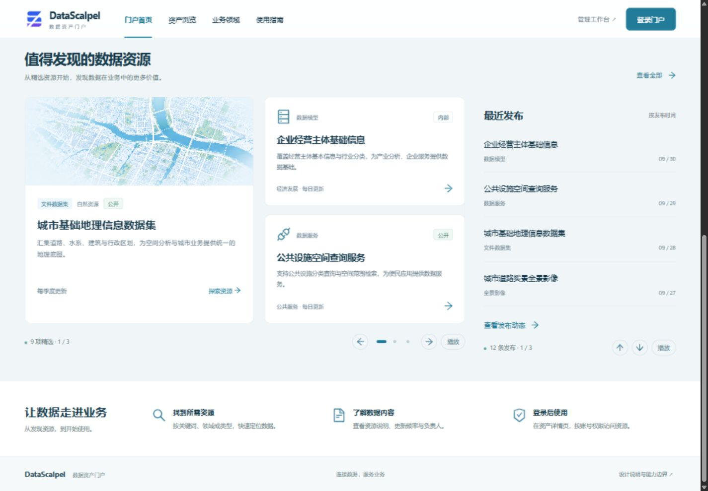

# 客户资产门户设计

状态：已按确认设计实现，真实开发环境验证记录见文末。更新日期：2026-10-01。

本文供产品、设计和开发共同使用，说明客户资产门户展示什么、从哪里取数、如何检索与浏览，以及首页动态展示的规则。已交付独立 HTML 设计稿，并完成业务前后端接入；HTML 继续作为评审快照，不作为生产数据来源。既有登记、发布、同步和权限规则仍以[资产登记、发布与元数据同步](asset-publication-and-synchronization.md)为准。

## 设计成果

- [交互 HTML 原型](assets/asset-portal-customer/asset-portal.html)：下载后可直接用浏览器打开，无需服务端；包含首页、资产浏览、详情和设计说明。
- [首页整体效果](assets/asset-portal-customer/home.jpg)：静态构图参考，精选区以最新动态版为准。
- [精选与最近发布效果](assets/asset-portal-customer/discovery.jpg)：最新动态区域布局。
- [资产浏览效果](assets/asset-portal-customer/catalog.jpg)与[资产详情效果](assets/asset-portal-customer/detail.jpg)：页面结构参考。

原型中的资源名称、数量、时间和元数据均为示例，不是对当前数据库的统计。首页的 926 项及领域数量用于展示内容密度；交互目录包含 12 条示例资产，早期静态目录截图中的 8 条不作为最终数量。正式页面必须全部使用真实接口数据。

## 面向客户的定位

门户帮助客户发现资源、了解用途、判断是否适用，并在登录及权限校验后进入原资源。后台负责登记、整理、发布和同步；门户负责展示与发现。

原资源满足登记条件后，由管理员单条或批量登记为资产草稿，补充门户信息，再发布到门户。仅在后台存在原资源，并不会自动出现在门户；全量检查或同步也不会自动登记或发布资源。

统一数据范围是 `ds_asset` 中状态为 `PUBLISHED` 的资产。草稿与下线资产不参与首页统计、推荐、最近发布、搜索、目录和详情。统计单位为资产项，不是业务表的数据行、数据集的文件数或接口调用次数。

五类来源为数据模型、文件数据集、全景影像、码表和数据服务。资产保留安全元数据摘要，实际数据和资源操作仍由原模块提供。

## 页面结构

| 页面或区域 | 展示内容 | 主要行为 |
| --- | --- | --- |
| 顶部导航 | 门户首页、资产浏览、业务领域、使用指南，次要位置保留管理工作台和登录 | 首页与目录切换；领域、指南定位首页对应区域 |
| 首页主视觉 | 平台定位、资源搜索框、热门标签 | 输入关键词或点击标签，进入带条件的资产浏览 |
| 资产概览 | 已发布总数、五类资源数量 | 点击类型进入对应目录 |
| 业务领域 | 领域名称、资产数量及图标 | 按所选领域及后代领域筛选 |
| 精选资源 | 推荐资产的名称、类型、领域、简介、敏感等级、更新频率 | 每屏 3 项，横向切换，点击进入详情 |
| 最近发布 | 名称、类型、发布日期 | 每屏 4 条，向上切换，点击进入详情 |
| 使用指南 | 查找资源、了解内容、登录使用 | 解释现有使用路径 |
| 资产浏览 | 领域筛选、类型切换、关键词、排序、分页、资产卡片 | 查询全部符合条件的已发布资产 |
| 资产详情 | 门户信息、治理信息、类型化安全元数据、可用性状态和使用入口 | 登录后按来源权限进入原资源 |

首页展示目录的一部分，资产浏览提供完整查询入口；首页轮播数量限制不限制目录的查询总量。

## 展示字段与检索口径

门户名称与简介允许用客户容易理解的语言覆盖来源技术名称和说明，不回写原资源。它们直接影响门户展示与关键词匹配，不能理解为“搜索只与原资源定义有关”。

| 门户字段 | 取值规则 | 是否参与关键词检索 |
| --- | --- | --- |
| 资产名称 | 优先 `portalName`，未填写时使用来源名称 `sourceName` | 是，匹配有效展示名称 |
| 资产编码 | 来源编码 `sourceCode` | 是 |
| 资产简介 | 优先 `portalSummary`，未填写时使用来源说明 `sourceDescription` | 是，匹配有效展示简介 |
| 检索标签 | 登记或编辑资产时维护的标签 | 是 |
| 业务领域 | 资产 `directoryId` 关联的 ASSET 业务领域 | 独立筛选，不作为当前关键词匹配字段 |
| 负责人、更新频率、敏感等级 | 资产治理字段 | 当前不参与关键词检索 |

检索标签是帮助发现资产的关键词。例如技术编码为 `CITY_PARKING` 的资产，可填写“停车设施”“交通出行”。标签最多 10 个，可跨领域复用；标签不是业务领域，也不会让搜索深入原资源内容。热门标签按已发布资产中真实标签的出现频次生成，并不代表用户搜索热度。

搜索统一查询资产元数据，不遍历原业务数据库，不搜索表内具体企业、人员等数据行，也不搜索文件正文。现有后端通过资产表上的模糊匹配完成全局查询，无需为本版引入独立搜索引擎。

业务领域、资源类型、关键词之间取 AND；关键词在有效名称、编码、有效简介、标签之间取 OR。例如“交通出行 + 文件数据集 + 停车场”只返回同时满足三个条件的已发布资产。名称已有门户覆盖值时，不承诺同时命中被覆盖的来源名称。

## 统计口径

| 指标 | 统计规则 |
| --- | --- |
| 已发布资产总数 | `status = PUBLISHED` 的资产记录数量 |
| 五类资源数量 | 在已发布范围内按 `assetType` 分组计数；五类合计等于总数 |
| 首页业务领域数量 | 按后台“数据资产 / 业务领域”维护的 ASSET 目录统计，顶级领域包含自身及全部后代领域 |
| 目录查询结果数量 | 已发布范围内，叠加当前领域、类型、关键词后得到的匹配总数 |
| 领域筛选旁数量 | 展示各领域的已发布资产数量；本版采用全局领域数量，不随关键词或类型联动变化 |

领域按资产登记时选择的领域归属统计，不从原资源名称、标签或内容推断。单个资产保存一个领域 UUID，父级统计包含后代，因此不能将父级和子级数量再次相加作为全局总数。

来源缺失或暂不可用不自动改变资产发布状态，因而仍可能参与上述统计；详情必须如实标识来源可用性或缓存状态。不能将“已发布数量”标注为“当前可正常使用数量”。

## 精选与最近发布

| 规则 | 左侧精选资源 | 右侧最近发布 |
| --- | --- | --- |
| 查询范围 | 已发布且开启“门户推荐”的资产 | 全部已发布资产，不受推荐状态影响 |
| 排序 | 资产登记创建时间 `createdAt DESC`，同时间按 `id DESC` | 资产发布时间 `publishedAt DESC`，同时间按 `id DESC` |
| 首页取数上限 | 9 项 | 12 项 |
| 同时可见数量 | 3 项，1 张主卡片与 2 张辅助卡片 | 4 条列表记录 |
| 切换方向 | 横向整组切换 | 向上整组切换 |
| 自动切换间隔 | 6 秒 | 4 秒 |
| 切换过渡 | 约 700 毫秒 | 约 700 毫秒 |
| 更多入口 | 查看全部资产 | 进入资产浏览并使用“最近发布”排序 |

“创建时间”指资产登记记录的创建时间，不是来源资源的创建时间。右侧使用发布时间，避免很早登记、今天发布的资产被遗漏。最终默认间隔由本轮“适当缩小”调整为 6 秒和 4 秒；取代上一版 8.5 秒和 6.5 秒。

两个区域允许出现同一资产：一个体现人工推荐，另一个体现发布顺序。不开启推荐的资产不进入精选，但仍可在目录和最近发布中出现。精选不足时不自动补入未推荐资产。

### 播放与操作

- 每次切换保留停留时间，避免连续匀速跑动影响阅读。
- 鼠标悬停或键盘焦点进入区域时暂停；离开后重新计时。用户主动暂停后保持暂停，直到点击播放。
- 提供上一组、下一组、当前组数及播放暂停按钮；精选区另提供页点定位。
- 键盘可访问所有可见入口，离屏组不进入 Tab 顺序；自动切换不抢焦点、不反复播报内容。
- 区域离开可视范围、浏览器标签页隐藏或离开首页时停止计时；返回后重新计时。切页销毁计时器与观察器。
- 遵循系统减少动态效果偏好，默认关闭自动播放和过渡，保留手动切换。
- 不足一屏时按实际数量展示并关闭自动切换；最后一组不足时不复制资产凑数。空数据不展示演示内容。

窄屏下精选卡片与最近发布纵向排列，保持信息可读和可操作，不强行压缩为桌面三栏。图像和图标不暗示真实覆盖范围；缺少资源封面时采用类型图形，不伪造资源预览。

## 资产浏览与详情

资产浏览默认“全部领域 + 全部类型”，每页 12 项，最多 48 项，沿用现有分页契约。修改关键词、领域或类型时回到第一页。清除筛选恢复全部已发布资产。默认排序为“推荐优先”，另提供“最近发布”；精选区按创建时间的排序不改变目录默认排序。

资产卡片优先呈现客户可理解的名称与用途，编码作为次要信息；同时展示类型、领域、标签、负责人、更新频率、敏感等级和详情入口。目录数量较多时由后端分页，不能把首页轮播的 9 项或 12 项当成全量数据在前端筛选。

详情展示通用治理信息和来源类型对应的安全元数据，复用既有实时读取与缓存回退语义。来源不可用显示不可用提示；来源缺失或读取失败时说明展示的是最近成功快照。页面不展示凭据、SQL、脚本、物理存储地址或内部错误。

匿名用户可以查看全部已发布资产的门户元数据，`PUBLIC`、`INTERNAL`、`SENSITIVE` 是等级标识，不是新增门户过滤条件。使用资产仍需登录并经过既有来源查看权限校验；本版不引入新权限体系或申请审批流程。

搜索无结果时显示当前条件并提供清除筛选；接口失败时显示错误与重试，不使用示例数据填充。空领域、空推荐和空发布区域需要真实空态；下线资产应从列表和详情中退出。

## 视觉与参考成果

视觉方向采用湖蓝、冷灰白背景与空间城市主视觉。首页保持较大留白；目录提高信息密度；强调名称、用途和下一步操作。沿用工程已有图标体系，不新增 UI 框架。页面中的地图为品牌概念图，不承诺数据覆盖范围或真实预览能力。

参考系统为 `F:/workspace/supermapWorkspace/scp-datafusion/frontend/scp-datacenter-web`。已参考的成果与取舍如下。

| 参考成果 | 本版借鉴 | 范围边界 |
| --- | --- | --- |
| 首页 `searchNav.vue`、`metaTotal.vue`、`quickNav.vue` | 搜索优先、标签引导、资源规模、业务入口 | 使用当前五类资产与真实统计 |
| `platform-homepage.md` 及首页效果 | 推荐资源与新增内容分区 | 没有访问量依据，不称为热度排行 |
| `platform-assetmanage.md` 及目录效果 | 左侧业务领域、右侧资源结果、详情路径 | 使用现有资产登记与发布模型 |
| `platform-onemap.md` | 空间数据与地图关联的浏览思路 | 资产一张图待具备图层、范围和预览契约后另行设计 |
| `bigscreenNav.vue` 及应用成果 | 数据形成业务成果的展示思路 | 本版不增加没有真实案例与链接支撑的应用区 |

## 已实现的接口接入

| 能力 | 实现 |
| --- | --- |
| 概览、类型、领域、标签 | 复用 `GET /api/v1/asset-portal/overview`，全部使用真实数据 |
| 目录检索与分页 | `GET /api/v1/asset-portal/assets`，保留 keyword、assetType、directoryId、page、size；增加 featured 和 sort |
| 默认推荐排序 | `sort=RECOMMENDED` 或省略，保留 `featured DESC, publishedAt DESC, id DESC` |
| 精选资源 | `featured=true&sort=CREATED&size=9`，仅查询已发布推荐资产 |
| 最近发布 | `sort=LATEST&size=12`，按发布时间倒序，不受推荐优先影响 |
| 详情与使用 | 复用原详情和来源导航接口，保留登录、来源权限校验及缓存回退 |
| 资源封面 | 采用品牌地图示意图和类型图标；真实封面配置未新增 |

`featured` 可省略；true 仅推荐，false 仅未推荐。`sort` 仅允许 RECOMMENDED、LATEST、CREATED，均以 UUID 倒序保证同时间的稳定排序，无效值返回 400。排序与分页均由后端执行。完整现行契约见[资产登记、发布与元数据同步](asset-publication-and-synchronization.md)。

前端路由为 `/assets`、`/assets/browse`、`/assets/{id}`。目录条件保存在 URL，详情返回保留进入前的目录条件。轮播由资产模块独立组件实现；不足一屏不显示播放控件，不请求外部图片，不引入额外依赖。后台管理页面不受门户样式作用域影响。

继续使用当前模块化单体、JPA 与专用门户只读接口，不引入搜索中间件、额外业务模块或新的权限架构。门户不直接调用后台资产管理的 Search DSL。

## 实施核对清单

以下为页面及业务口径的核对依据，不改变工程当前测试政策；实际执行范围见文末记录。

- 草稿、下线资产不参与所有门户查询与统计；五类数量合计与总数一致。
- 领域计数包含后代，领域、类型、关键词可以组合；门户名称和简介的覆盖与回退符合口径。
- 精选只包含推荐资产，按登记创建时间取前 9 项；最近发布按发布时间取前 12 项，不受推荐排序干扰。
- 目录按后端匹配总数分页，首页更多入口携带正确筛选或排序条件。
- 两个轮播分别按 6 秒和 4 秒切换；暂停、键盘、离屏、路由切换及减少动态效果行为正确。
- 0 项、少于一屏、尾组不足、接口错误和来源不可用均有对应表现，不填充虚构数据。
- 手机与桌面无横向溢出，离屏卡片不可聚焦，详情及使用入口保留既有权限边界。

本轮交互 HTML 已验证分组切换、暂停、自动播放、示例详情跳转及桌面和手机断点布局。正式系统已接入，运行验证记录见下节。

## 实现与验证记录

2026-10-01 已完成首页、独立分页目录、详情视觉、真实统计与检索接入，以及 6 秒精选和 4 秒最近发布轮播。新增查询参数兼容旧调用；同时修复标签长文本在 Hibernate `lower()` 中触发类型校验、导致关键词搜索返回 500 的问题。标签表达式显式转换为字符串后再参与模糊匹配，不修改标签存储类型或数据库结构。

| 验证项 | 结果 |
| --- | --- |
| 前端 TypeScript 编译与门户相关 ESLint | 通过 |
| 后端 Business 及依赖模块编译 | 使用根 Maven Wrapper、原 settings 和 JDK 21，通过 |
| 轮播组件 3 项测试 | 定时间隔、自动与手动切换、离屏及焦点暂停、主动暂停、减少动态效果、单组不播放、卸载清理通过 |
| 真实环境启动 | 通过根 `start-local-dev.sh --admin-only --threads 4` 启动，local Profile，后端 8080、前端 8887，保留运行会话 |
| 运行时 OpenAPI | `/v3/api-docs` 已包含 featured、sort 的中文说明及 RECOMMENDED、LATEST、CREATED 枚举说明 |
| 真实只读接口 | 默认、仅推荐、仅未推荐、最近发布查询通过；非法排序返回 400；“停车”名称检索与“便民出行”标签检索均命中；不存在的关键词及字面量 `%` 返回 0 项 |
| 页面交互 | 首页、目录、详情可访问；中文搜索正常；从详情返回目录保留关键词 URL；1440px 桌面与 390px 手机检查无横向溢出，手机保留导航入口 |

验证时共享开发环境有 1 项已发布、未推荐资产：精选区显示真实空态，最近发布与目录显示该项；没有为验证新增、发布或修改业务资产。因此真实数据的多页数量与多组轮播未进行现场验证，轮播多组行为由组件测试和已确认的原型覆盖；未执行全仓测试或完整权限矩阵回归。

实际系统截图：[首页](assets/asset-portal-customer/implemented-home.jpg)、[目录搜索](assets/asset-portal-customer/implemented-catalog.jpg)、[详情](assets/asset-portal-customer/implemented-detail.jpg)、[手机首页](assets/asset-portal-customer/implemented-mobile.jpg)。这些截图展示真实开发环境内容，与上方示例设计稿分别保留。
