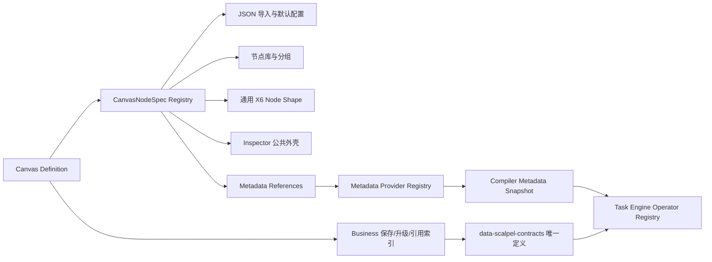

# Canvas 节点扩展架构

## 1. 文档状态

- 状态：架构已实施；本文保留设计背景、原实施计划与验收记录。
- 适用范围：Canvas 设计器、Canvas 稳定定义、Business 保存与发布准备、Task Engine 编译与运行。
- 当前开发入口：[前端约定](../../data-scalpel-ui/AGENTS.md)、[Task Engine 约定](../../data-scalpel-task-engine/AGENTS.md)及 [编译与执行规范](../development/task-engine.md)。
- 协议版本以 [当前读写端常量](../README.md#协议版本定位)为准；文中的历史版本、迁移、回退和验收步骤只适用于原重构，不自动适用于后续任务。

本文定义 DataScalpel 内置 Canvas 节点的扩展架构。目标不是提供运行时第三方插件，而是让新增内置 `INPUT`、`PROCESSOR`、`OUTPUT` 时，展示、配置、导入、图规则、元数据依赖和执行能力通过明确的编译期注册机制接入。

## 2. 背景与问题

本架构设计启动时已有 19 种 Canvas 节点；完成 Canvas `1.24` 后，前端与 Task Engine 显式 Registry 均为 37 种。这些是历史阶段数据。重构前稳定定义与 X6 已经解耦，但设计器能力仍分散在多个集中式文件：

- `canvasRegistry.tsx` 同时维护 Palette 模板、节点摘要、图标和 X6 React Shape。
- `CanvasNodeInspector.tsx` 同时包含大量节点表单和节点类型分发。
- `canvasDefinitionIO.ts` 集中解析全部节点配置并维护版本能力门禁。
- `canvasPorts.ts`、连接预校验、默认配置和元数据快照各自按节点类型分支。
- `data-scalpel-business` 与 `data-scalpel-contracts` 分别维护一套完整 Java Canvas 定义，并在任务准备时逐节点转换。

继续按重构前的方式新增节点会产生以下问题：

1. 一个节点需要修改多个互不约束的 `switch`，容易漏注册。
2. Palette 展示、Inspector、协议版本、端口和 Operator 支持模式可能不一致。
3. Input/Output 元数据查询按节点类型增长，相同资源访问逻辑重复。
4. Business 与 Contracts 的重复类型会使每个协议变更扩大为两套定义和一套映射。
5. 节点数量增加后，三大分类下的单层列表难以浏览。

## 3. 目标、非目标与原则

### 3.1 目标

- 每个前端节点由一个强类型 `CanvasNodeSpec` 完整描述。
- 新增节点不再扩张 Inspector、IO、摘要、端口和元数据 Hook 的节点类型大分支。
- 三大分类保持稳定，在分类内部使用二级分组组织节点。
- 节点专用 Inspector 保持显式类型，公共交互通过小型业务组件复用。
- 元数据获取按照资源种类扩展，而不是按照节点种类复制。
- `data-scalpel-contracts` 成为唯一 Java Canvas 稳定定义来源。
- 现有 Canvas JSON、HTTP API、数据库内容和协议版本保持兼容。
- Registry 完整性测试能够发现缺失、重复或不一致注册。

### 3.2 非目标

- 不支持运行时安装第三方节点。
- 不使用反射扫描、Spring Bean 扫描、Java `ServiceLoader` 或前端远程模块加载。
- 不实现收藏、最近使用、快捷键搜索或后台用户偏好。
- 不建立配置驱动的万能表单。
- 不新增后台元数据接口、数据库表、Maven 模块或前端应用。
- 不改变 `Map<tableName, CanvasTableSchema>` 的传播语义。
- 不把 Spark 类型、X6 Shape、React 组件或校验结果写入 Canvas Definition。

### 3.3 设计原则

- 稳定协议显式，设计器能力注册化。
- 编译期可发现，运行时不动态扩展。
- Task Engine 仍是业务有效性、Schema 传播和执行模式的权威来源。
- 前端图规则只用于即时交互约束，不替代 Task Engine 校验。
- 只有至少两个真实消费者的表单能力才抽取为公共组件。
- JSON 解析边界允许使用 `unknown`，节点配置内部不得使用 `any` 或任意属性 Map。

## 4. 总体架构



前端 Registry 与 Task Engine Registry 解决不同问题：

- `CanvasNodeSpec Registry` 维护设计器展示、配置和结构提示。
- `CanvasNodeOperatorRegistry` 维护编译与执行能力。
- 两者共享稳定 `type` 字符串，但不共享 React、X6、Spark 或运行时对象。
- 完整性测试保证两端都覆盖全部稳定节点类型。

## 5. 前端 CanvasNodeSpec

### 5.1 核心类型

`CanvasNodeSpec` 位于强类型 TypeScript 模块中。它可以通过 `ComponentType` 类型引用声明节点的 Canvas Body，但 Spec 模块本身不得渲染 UI、加载 Ant Design 组件或执行浏览器副作用：

```ts
type CanvasNodeByType<T extends CanvasNodeType> =
  Extract<CanvasNodeDefinition, { type: T }>;

type CanvasNodeConfigurationByType<T extends CanvasNodeType> =
  CanvasNodeByType<T>['configuration'];

type CanvasNodeRuntimeDataByType<T extends CanvasNodeType> =
  Extract<CanvasNodeRuntimeData, { type: T }>;

interface CanvasNodeGraphCapability {
  minInputs: number;
  maxInputs: number | null;
  minOutputs: number;
  maxOutputs: number | null;
}

interface CanvasNodeCanvasView<T extends CanvasNodeType> {
  resolveSize(
    configuration: CanvasNodeConfigurationByType<T>,
  ): Readonly<{ width: number; height: number }>;
  Body: ComponentType<{
    data: CanvasNodeRuntimeDataByType<T>;
  }>;
}

interface CanvasNodeSpec<T extends CanvasNodeType> {
  type: T;
  category: CanvasNodeCategory;
  group: CanvasNodeGroup;
  label: string;
  description: string;
  searchKeywords: readonly string[];
  iconKey: CanvasNodeIconKey;
  order: number;
  canvasView: CanvasNodeCanvasView<T>;
  supportedModes: readonly CanvasExecutionMode[];
  introducedInMinor: number;
  graph: CanvasNodeGraphCapability;

  createDefaultConfiguration(): CanvasNodeConfigurationByType<T>;
  parseConfiguration(
    value: unknown,
    path: string,
  ): CanvasParseResult<CanvasNodeConfigurationByType<T>>;
  summarize(data: CanvasNodeRuntimeDataByType<T>): string;
  collectMetadataReferences(
    node: CanvasNodeByType<T>,
  ): readonly CanvasMetadataReference[];
  loadInspector(): Promise<{
    default: CanvasNodeInspectorComponent<T>;
  }>;
}
```

约束：

- `loadInspector` 必须使用动态 `import()`；Spec 模块加载时不能执行 Inspector 模块。
- `iconKey` 是稳定的前端内部枚举，由 UI 层映射为 Ant Design Icon。
- `canvasView.Body` 是只读语义展示，节点目录必须自行声明；公共 Shape 不得增加节点类型 `switch`。
- `canvasView.resolveSize` 只依赖稳定配置并返回基础尺寸；校验摘要条和运行时元数据不得影响该结果。
- `introducedInMinor` 只表示该节点类型可出现的最小协议小版本。
- `graph` 表示节点度数和可视端口约束，不表达 Schema 或 Spark 执行语义。
- `parseConfiguration` 只负责安全加载稳定 JSON 结构，不进行上游表、字段或元数据业务校验。
- `summarize` 不得展示 Literal、运行参数值、凭据或数据行。

### 5.2 Registry

Registry 使用显式内置列表：

```ts
export const canvasNodeRegistry = createCanvasNodeRegistry([
  modelInputSpec,
  jdbcInputSpec,
  fileDatasetInputSpec,
  httpApiInputSpec,
  kafkaInputSpec,
  joinSpec,
  streamJoinSpec,
  renameSpec,
  filterSpec,
  selectColumnsSpec,
  deriveColumnsSpec,
  typeCastSpec,
  aggregateSpec,
  unionSpec,
  deduplicateSpec,
  modelOutputSpec,
  jdbcOutputSpec,
  kafkaOutputSpec,
  fileOutputSpec,
]);
```

Registry 提供：

```ts
interface CanvasNodeRegistry {
  all(): readonly CanvasNodeSpec<CanvasNodeType>[];
  require<T extends CanvasNodeType>(type: T): CanvasNodeSpec<T>;
  forCategory(
    category: CanvasNodeCategory,
    mode: CanvasExecutionMode,
  ): readonly CanvasNodeSpec<CanvasNodeType>[];
  resolveSize(data: CanvasNodeRuntimeData): CanvasNodeSize;
  canvasBody(type: CanvasNodeType): ComponentType<{
    data: CanvasNodeRuntimeData;
  }>;
}
```

创建时立即检查：

- `CanvasNodeType` 中的每种类型恰好注册一次。
- 不允许未知类型或重复类型。
- `supportedModes` 非空且没有重复值。
- `introducedInMinor` 位于 `0..CANVAS_SCHEMA_MINOR_VERSION`。
- `group` 的大类与 `category` 一致。
- `order` 是非负有限整数。
- 默认配置经 `canvasView.resolveSize` 派生的尺寸符合 Canvas 布局范围。
- 输入和输出度数满足 `0 <= min <= max`；`max=null` 表示不设上限。

Registry 错误属于开发错误，模块初始化时直接抛出，不转换为用户业务提示。

### 5.3 目录结构

```text
src/modules/task/canvas/
├── nodes/
│   ├── registry.ts
│   ├── nodeSpec.ts
│   ├── nodeGroups.ts
│   ├── nodeIcons.tsx
│   ├── common/
│   │   ├── CanvasInputTableSelect.tsx
│   │   ├── CanvasColumnSelect.tsx
│   │   ├── CanvasOutputTableNameField.tsx
│   │   ├── CanvasColumnMappingEditor.tsx
│   │   ├── CanvasSortFieldEditor.tsx
│   │   └── CanvasNodeValidationIssues.tsx
│   ├── jdbc-input/
│   │   ├── spec.ts
│   │   ├── canvasView.tsx
│   │   └── JdbcInputInspector.tsx
│   ├── filter/
│   │   ├── spec.ts
│   │   ├── canvasView.tsx
│   │   ├── FilterInspector.tsx
│   │   └── filterConditionDraft.ts
│   └── ...
├── metadata/
│   ├── metadataReference.ts
│   ├── metadataProvider.ts
│   ├── providerRegistry.ts
│   └── providers/
└── components/
    ├── CanvasNodeInspector.tsx
    └── CanvasNodePalette.tsx
```

每种节点必须拥有独立目录。节点私有的语义 Body、尺寸解析器、编辑器、选项、校验草稿函数和测试放在本节点目录。真正被多个现有节点复用的只读视觉原语保持窄职责，不得演变为配置驱动的万能卡片。

### 5.4 JSON 导入与默认配置

导入流程固定为：

1. `canvasDefinitionIO` 解析协议版本、节点数组、边数组和公共节点字段。
2. 读取字符串 `type`，通过 Registry 获取 Spec。
3. 若 `sourceSchemaMinorVersion < spec.introducedInMinor`，返回节点版本能力错误。
4. 调用 `spec.parseConfiguration` 解析配置。
5. 解析成功后组装判别联合 `CanvasNodeDefinition`。
6. 保留现有重复 ID、布局、边端点和协议版本校验。
7. 兼容定义规范化为当前读写端声明的大/小版本，具体规则见 [协议版本规范](../development/task-engine.md#protocol-versions)。

`emptyNodeConfiguration(type)` 改为调用 `registry.require(type).createDefaultConfiguration()`。旧函数名可以保留为薄适配层，避免调用方一次性重写；实现完成后不得再包含节点类型分支。

### 5.5 Inspector 动态加载

`CanvasNodeInspector` 只保留：

- Inspector 标题、关闭和删除入口。
- 当前节点校验状态。
- 未应用修改检测。
- 应用并继续、放弃修改、继续编辑保护流程。
- `Suspense` 加载状态和 Inspector 加载失败提示。
- 通过 `registry.require(node.type).loadInspector()` 渲染节点专用 Inspector。

节点专用 Inspector 通过泛型 Props 接收已经收窄的节点类型：

```ts
interface CanvasNodeInspectorProps<T extends CanvasNodeType> {
  node: CanvasNodeByType<T>;
  executionMode: CanvasExecutionMode;
  validation: CanvasNodeValidationResult | undefined;
  validationUnavailableMessage: string | null;
  onApply(update: CanvasNodeConfigurationUpdateByType<T>): void;
  onDirtyChange(dirty: boolean): void;
  inspectorRef: Ref<CanvasNodeInspectorHandle>;
}
```

Inspector 加载失败不修改节点配置；面板显示持续错误和重试入口。

### 5.6 通用 X6 Shape

- 所有节点统一使用运行时 Shape `datascalpel-canvas-node`。
- Shape 根据运行时 `type` 查询 Spec，取得类别、图标、标签和摘要。
- X6 DnD、历史记录和导入从稳定 Definition 重建 Shape。
- 旧 Shape 名只存在于运行时，未进入持久化 JSON，因此不需要数据迁移或兼容分支。
- 节点尺寸仍来自 Definition `layout`；Spec 尺寸只用于新建节点。

## 6. 节点库信息架构

### 6.1 三大分类

顶层固定：

1. 输入
2. 处理器
3. 输出

不得因新增具体技术类型增加第四个顶层按钮。

### 6.2 二级分组

分组 ID 是前端内部稳定字符串：

| Category | Group ID | 名称 | 顺序 |
| --- | --- | --- | ---: |
| INPUT | `input.database` | 数据库 | 10 |
| INPUT | `input.file` | 文件与对象存储 | 20 |
| INPUT | `input.stream` | 消息流 | 30 |
| INPUT | `input.api` | API | 40 |
| INPUT | `input.model` | 模型 | 50 |
| PROCESSOR | `processor.row` | 行处理 | 10 |
| PROCESSOR | `processor.column` | 字段处理 | 20 |
| PROCESSOR | `processor.relational` | 关联与集合 | 30 |
| PROCESSOR | `processor.aggregate` | 聚合分析 | 40 |
| PROCESSOR | `processor.quality` | 数据质量 | 50 |
| PROCESSOR | `processor.stream` | 流式处理 | 60 |
| OUTPUT | `output.database` | 数据库 | 10 |
| OUTPUT | `output.file` | 文件与对象存储 | 20 |
| OUTPUT | `output.stream` | 消息流 | 30 |
| OUTPUT | `output.api` | API | 40 |
| OUTPUT | `output.model` | 模型 | 50 |

当前没有节点的分组不显示。

### 6.3 初始 19 种节点迁移表

| Node Type | Category | Group | Modes | Introduced | Inputs | Outputs |
| --- | --- | --- | --- | ---: | --- | --- |
| `JDBC_INPUT` | INPUT | `input.database` | BATCH, STREAMING | 0 | 0 | 1..* |
| `FILE_DATASET_INPUT` | INPUT | `input.file` | BATCH | 4 | 0 | 1..* |
| `KAFKA_INPUT` | INPUT | `input.stream` | STREAMING | 5 | 0 | 1..* |
| `HTTP_API_INPUT` | INPUT | `input.api` | BATCH | 0 | 0 | 1..* |
| `MODEL_INPUT` | INPUT | `input.model` | BATCH | 1 | 0 | 1..* |
| `FILTER` | PROCESSOR | `processor.row` | BATCH, STREAMING | 7 | 1..* | 1..* |
| `DEDUPLICATE` | PROCESSOR | `processor.row` | BATCH | 13 | 1..* | 1..* |
| `RENAME` | PROCESSOR | `processor.column` | BATCH, STREAMING | 2 | 1..* | 1..* |
| `SELECT_COLUMNS` | PROCESSOR | `processor.column` | BATCH, STREAMING | 8 | 1..* | 1..* |
| `DERIVE_COLUMNS` | PROCESSOR | `processor.column` | BATCH, STREAMING | 9 | 1..* | 1..* |
| `TYPE_CAST` | PROCESSOR | `processor.column` | BATCH, STREAMING | 10 | 1..* | 1..* |
| `JOIN` | PROCESSOR | `processor.relational` | BATCH | 0 | 1..* | 1..* |
| `UNION` | PROCESSOR | `processor.relational` | BATCH, STREAMING | 12 | 1..* | 1..* |
| `AGGREGATE` | PROCESSOR | `processor.aggregate` | BATCH | 11 | 1..* | 1..* |
| `STREAM_JOIN` | PROCESSOR | `processor.stream` | STREAMING | 3 | 1..* | 1..* |
| `JDBC_OUTPUT` | OUTPUT | `output.database` | BATCH, STREAMING | 0 | 1 | 0 |
| `FILE_OUTPUT` | OUTPUT | `output.file` | BATCH | 6 | 1 | 0 |
| `KAFKA_OUTPUT` | OUTPUT | `output.stream` | STREAMING | 5 | 1 | 0 |
| `MODEL_OUTPUT` | OUTPUT | `output.model` | BATCH, STREAMING | 0 | 1 | 0 |

说明：

- 所有 Processor 的配置按表名选择逻辑表；这些表可以来自同一条边或多个上游表 Map，因此图入边统一为 `1..*`。
- 非 Output 节点至少一条出边；`maxOutputs=null`。
- `JDBC_INPUT` 在流任务中仍产生有界静态维表，Spec 只表达模式支持，不表达表有界性。

### 6.4 Palette 交互

- 打开分类后显示分类标题、总数、搜索框、“全部”和非空二级分组。
- 没有搜索词时，分组筛选生效；“全部”按分组顺序展示分段列表。
- 输入搜索词后忽略当前分组，搜索当前大类所有可用节点，并按分组展示匹配结果。
- 搜索匹配 label、type、description 和 searchKeywords，不改变现有精确字符串匹配规则。
- 节点按 `group order -> spec order -> type` 稳定排序。
- 模式标签：
  - 仅 BATCH：`批`
  - 仅 STREAMING：`流`
  - 同时支持：`批/流`
- 当前执行模式不支持的节点继续隐藏，不显示禁用占位。
- 切换顶层分类时清空搜索和二级分组。
- 拖拽、点击添加、Esc、焦点恢复、Inspector Dirty 保护和新增后关闭浮层保持现状。

## 7. 公共配置积木

首批只抽取已有重复实现：

### 7.1 `CanvasInputTableSelect`

- 输入为 Compiler 返回的 `inputTables`、当前保存值和变更回调。
- 自动展示字段数量和有界性。
- 保存值失效时在选项原位置保留“已失效”项目并显示错误状态。
- Compiler 不可用时显示等待/失败占位，不把空响应解释为没有表。

### 7.2 `CanvasColumnSelect`

- 支持单选和多选两个明确组件或明确 Props 联合，不暴露任意 Select Props。
- 字段来源必须是选中表的 Compiler Schema。
- 展示字段名、平台类型和 nullable。
- 保留失效字段，不静默删除或重排。

### 7.3 `CanvasOutputTableNameField`

- 统一必填、去除首尾空白和最大长度规则。
- 不检查上游 Map 冲突；冲突仍由 Task Engine 返回。

### 7.4 `CanvasColumnMappingEditor`

- 服务 JDBC、Model、Kafka Output。
- 固定按目标字段展示显式映射，并保留失效源字段和目标字段。
- 自动匹配只在设计时填充空白映射，运行时不推导字段名称。

### 7.5 `CanvasSortFieldEditor`

- 服务 Deduplicate 以及未来 Sort/Window 类节点。
- 编辑字段、方向和 NULL 顺序。
- 是否允许空排序、是否允许重复字段由调用节点配置和 Task Engine 校验决定。

### 7.6 `CanvasNodeValidationIssues`

- 统一节点错误、警告和 Compiler 不可用状态。
- 继续使用紧凑摘要与展开查看，不恢复占满 Drawer 的长列表。

公共组件不得包含特定节点的配置 DTO，也不得直接调用节点专属 API。

## 8. 元数据 Reference 与 Provider

### 8.1 Reference 判别联合

每个 Reference 必须包含 `nodeId`，用于聚合查询失败的受影响节点：

```ts
type CanvasMetadataReference =
  | JdbcTableMetadataReference
  | ModelMetadataReference
  | FileDatasetTableMetadataReference
  | HttpApiResourceMetadataReference
  | KafkaTopicMetadataReference
  | S3TargetMetadataReference;
```

稳定字段：

```ts
interface JdbcTableMetadataReference {
  kind: 'JDBC_TABLE';
  nodeId: string;
  role: 'SOURCE' | 'DISTRIBUTION';
  dataSourceId: string;
  tableName: string;
}

interface ModelMetadataReference {
  kind: 'MODEL';
  nodeId: string;
  role: 'SOURCE' | 'TARGET';
  modelId: string;
}

interface FileDatasetTableMetadataReference {
  kind: 'FILE_DATASET_TABLE';
  nodeId: string;
  fileDatasetTableId: string;
}

interface HttpApiResourceMetadataReference {
  kind: 'HTTP_API_RESOURCE';
  nodeId: string;
  dataSourceId: string;
  resourceId: string;
}

interface KafkaTopicMetadataReference {
  kind: 'KAFKA_TOPIC';
  nodeId: string;
  role: 'SOURCE' | 'DISTRIBUTION';
  dataSourceId: string;
  topic: string;
}

interface S3TargetMetadataReference {
  kind: 'S3_TARGET';
  nodeId: string;
  dataSourceId: string;
}
```

配置字段为空时 Spec 不生成 Reference；缺失配置由 Task Engine 处理。

### 8.2 Provider 接口

```ts
interface CanvasMetadataProvider<R extends CanvasMetadataReference> {
  kind: R['kind'];
  key(reference: R): string;
  queryOptions(reference: R): CanvasMetadataQueryOptions;
  resolve(
    references: readonly R[],
    queryResult: CanvasMetadataQueryResult,
  ): CanvasMetadataContribution;
}
```

`CanvasMetadataContribution` 可以贡献：

- `TaskCompilationMetadataDataSource[]`
- `TaskCompilationMetadataModel[]`
- `TaskCompilationMetadataFileDatasetTable[]`
- `Map<nodeId, CanvasNodeRuntimeSummary>`
- `CanvasMetadataIssue[]`

Provider 不调用 React Hook。统一 Hook 收集并去重 Reference 后，通过 TanStack Query `useQueries` 执行查询，再调用 Provider 的纯转换函数。

### 8.3 去重与冲突

- 去重 Key 不包含 `nodeId`，同一资源只查询一次。
- Provider 保留同一 Key 关联的全部 nodeId。
- 相同 UUID 的 Snapshot 条目内容一致时合并。
- 相同 UUID 产生不一致内容时返回 `METADATA_CONTRIBUTION_CONFLICT`，阻止当前编译。
- 查询失败继续使用现有稳定问题码：
  - `MODEL_READ_FAILED`
  - `DATA_SOURCE_READ_FAILED`
  - `TABLE_METADATA_READ_FAILED`
  - `API_RESOURCE_READ_FAILED`
  - `FILE_DATASET_METADATA_READ_FAILED`
- Provider 不制造部分表 Schema；任何必需元数据缺失都形成持续问题。

### 8.4 现有 API 边界

- JDBC Provider 复用数据源详情和表元数据 API。
- Model Provider 复用模型详情和已保存模型字段，不执行物理表结构相等检查。
- File Dataset Provider 复用 Canvas 文件表元数据 API。
- HTTP API Provider 复用数据源与 API Resource 详情。
- Kafka Provider 使用数据源/Topic 元数据和节点内联 Value Schema。
- S3 Target Provider 只验证目标数据源元数据，不读取对象内容。
- 所有跨业务模块引用继续通过对应模块 `index.ts` 公开入口。

## 9. Java Canvas 契约合并

### 9.1 唯一稳定定义

合并后唯一 Java 定义位于 `data-scalpel-contracts`：

- `CanvasDefinition`
- `CanvasNodeDefinition`
- 所有 Node Definition
- 所有 Configuration、表达式、枚举和边定义

`data-scalpel-business` 删除内部 `task.canvas.CanvasDefinition` 及其嵌套类型。Business Web Request/Response、保存服务、升级器、引用索引和 Manifest 直接使用 Contracts。

### 9.2 草稿兼容 ID

Canvas Definition 中由用户配置的资源引用必须能表达空草稿。以下字段从 Java `UUID` 改为 `String`：

| Configuration | Field |
| --- | --- |
| `ModelInputConfiguration` | `modelId` |
| `ModelOutputConfiguration` | `targetModelId` |
| `KafkaInputConfiguration` | `dataSourceId` |
| `KafkaOutputConfiguration` | `dataSourceId` |

以下类型继续使用 UUID，因为它们不是未配置草稿字段：

- `MetadataDataSource`
- `MetadataModel`
- `MetadataFileDatasetTable`
- `CanvasTableOrigin`
- `TaskCompilationRequest.requestId`
- `TaskCompilationResponse.requestId`

现有 JDBC、HTTP API、File Dataset、File Output 配置已经使用字符串 ID，保持不变。

### 9.3 保存与编译校验

Business 保存边界：

- 空字符串允许作为未配置草稿。
- 非空字符串必须是 UUID；非法值继续返回 HTTP 400 ProblemDetail。
- 不验证资源是否存在、是否启用或字段是否兼容。
- 兼容定义保存时规范化为当前小版本；大版本不兼容定义不隐式迁移或覆盖。

Task Engine 直接编译边界：

- 空模型 ID：`MODEL_ID_REQUIRED`。
- 非空非法模型 ID：`INVALID_MODEL_ID`。
- 空数据源 ID：现有必填错误。
- 非空非法数据源 ID：`INVALID_DATA_SOURCE_ID`。
- 解析失败形成节点 `ERROR`，保留已安全推导的 `inputTables`，不抛出未分类异常。

`CanvasNodeSupport` 提供带资源标签和稳定错误码的 UUID 解析辅助方法。Operator 仍负责决定空值错误码、错误路径和后续元数据查找。

### 9.4 Business 迁移

按以下顺序迁移，过程中不保留长期双模型：

1. 调整 Contracts 草稿 ID 类型并补齐 `CanvasDefinition.empty()`、有效小版本辅助方法。
2. 让 Business Validator 和 Upgrader 接受 Contracts 类型。
3. 迁移 Web Request/Response 和 Definition Service。
4. 迁移模型关系、文件引用、数据源引用和发布检查。
5. 迁移 Manifest 与 TaskRun/Streaming 准备服务。
6. 删除 `compilationDefinition` 整棵节点转换及表达式转换函数。
7. 删除 Business 重复 Canvas 定义。
8. 全局搜索并确认 Business 不再引用旧包。

数据库中的 JSON 文本不转换；新旧 Java 类型序列化结果必须语义一致。

### 9.5 Task Engine Registry

Task Engine 继续显式注册内置 Operator。每个 `CanvasNodeType`：

- 恰好有一个无状态 Operator。
- 声明非空 `supportedModes`。
- Compiler 与 Runner 使用同一 Registry。
- 不从前端 Spec、Canvas JSON 或 Manifest 读取运行模式能力。

本次重构不改变 Operator 业务行为和 Schema 传播。

## 10. 兼容、上线与回退

### 10.1 兼容

- Canvas JSON 字段、节点类型和配置语义不变。
- Registry 架构重构本身不单独占用协议版本；写出版本遵循当前读写端常量，不再以原迁移记录中的 Canvas `3.0` 为现行值。
- HTTP API 路径、请求和响应 JSON 不变。
- 数据库表和已保存 JSON 不迁移。
- X6 Shape 变化属于内存实现，不影响持久化。
- 不增加功能开关或新旧 Registry 双写。

### 10.2 上线

这是原子代码重构：

1. 所有 19 种节点迁移完成后才删除旧分发逻辑。
2. 前端 Registry 完整性测试通过后才删除旧模板数组和节点类型分支。
3. Business 全部调用方改用 Contracts 后才删除重复定义和转换。
4. 不允许发布一个只迁移部分节点的长期中间状态。

### 10.3 回退

原重构的回退假设是协议、API 和数据库均未改变，且没有混入新节点或配置字段。这个假设不适用于后续协议升级，也不保证当前 JSON 可由旧版本 `1.13` 读取。回退前必须核对目标读写端的协议范围；不同大版本及未来小版本按现行规则拒绝读取。

## 11. 新增节点标准流程

新增内置节点必须完成：

1. 在 Contracts 增加明确的 Configuration、Definition、NodeType 和 Jackson subtype。
2. 判断是否需要升级协议小版本，并记录 `introducedInMinor`。
3. 在前端新增独立节点目录和一个 `CanvasNodeSpec`。
4. 声明分类、二级分组、模式、图度数、默认配置、解析器、安全摘要和元数据引用。
5. 实现节点专用 Inspector，优先组合公共配置积木。
6. 在 Task Engine 增加唯一 Operator 并显式注册。
7. 定义 Schema 传播、有界性、错误码和安全日志摘要。
8. 更新正式协议文档和针对性测试。
9. 通过前端 Spec 与后端 Operator 完整性测试。

禁止通过以下方式“快速接入”：

- 在节点配置中增加 `Record<string, unknown>` 或 `Map<String, Object>`。
- 在现有节点中堆叠语义不同的大量可选字段。
- 只在 Palette 展示但没有 Operator。
- 只在 Task Engine 支持但没有稳定 Definition 和 Inspector。
- 新增新的中心化节点类型 `switch`。

## 12. 原实施测试矩阵

以下是原重构的验收范围；后续任务是否执行测试，遵循 [根测试政策](../../AGENTS.md#测试与验证暂时禁用)与本次用户要求。

### 12.1 前端 Registry

- 19 种 `CanvasNodeType` 全覆盖且无重复。
- category/group 一致。
- supportedModes 非空。
- introducedInMinor 与协议历史一致。
- 默认配置类型和值正确。
- 所有 Inspector Loader 可加载正确组件。
- 通用 Shape 对全部节点生成正确类别、摘要和状态。

### 12.2 导入导出

- 每种节点有效 JSON 导入成功。
- 缺失或错误配置结构被拒绝。
- 业务未配置草稿允许导入。
- 低版本携带高版本节点被拒绝。
- 导入后再次导出语义一致。
- JSON 不包含 Shape、React、图标、分组、模式能力或校验结果。

### 12.3 Palette

- 批流模式分类数量正确。
- 二级分组和节点映射正确。
- 空分组隐藏。
- 搜索时跨分组匹配。
- 模式标签正确。
- 拖拽、点击添加、Esc、焦点和 Dirty 保护回归。

### 12.4 Inspector 与公共积木

- Registry 路由全部节点 Inspector。
- 上游变化后表和字段失效值保留。
- Compiler 等待和失败不显示为无候选。
- 公共映射、排序和字段组件不修改节点专属配置语义。
- Inspector 动态加载失败可重试且不丢配置。

### 12.5 Metadata Provider

- Spec Reference 收集覆盖现有 Input/Output。
- 相同资源只查询一次并合并 nodeId。
- Provider 查询失败产生现有错误码。
- Snapshot 和节点摘要与重构前一致。
- 冲突 Contribution 阻止编译。
- 不完整元数据不制造部分 Schema。

### 12.6 Java 契约

- 当前示例 JSON 使用新 Contracts 往返一致。
- 四个字符串 ID 支持空草稿。
- Business 拒绝非空非法 UUID。
- Task Engine 对非法模型/数据源 ID 返回稳定节点错误。
- Business 保存、升级、响应、Manifest、引用索引结果保持一致。
- Business 不再存在旧 Canvas Definition 引用。

### 12.7 最终验证

原实施任务要求全部代码完成后统一执行：

```bash
./mvnw -pl data-scalpel-business,data-scalpel-task-engine -am test
cd data-scalpel-ui
pnpm lint
pnpm build
pnpm vitest run --maxWorkers=1
git diff --check
```

上述执行要求只适用于原实施任务，不构成后续任务的强制验收要求；是否执行遵循根文件测试政策及当前任务要求。

## 13. 开发规范落点

实现和验证完成后更新：

### 根 `AGENTS.md`

- Contracts 是唯一 Java Canvas 稳定定义来源。
- 草稿资源引用保存为字符串；UUID 解析发生在明确校验边界。
- 新节点必须声明协议版本、模式、分类、图规则、Schema 传播和安全摘要。
- 内置节点不得引入运行时插件或扫描机制。

### `data-scalpel-ui/AGENTS.md`

- 新节点必须通过 `CanvasNodeSpec` 和独立节点目录接入。
- 禁止继续扩张 Inspector、IO、端口、摘要和元数据 Hook 的节点类型大分支。
- 元数据依赖通过 Resource Provider 扩展。
- 公共表单组件必须具有至少两个真实消费者。
- 前端结构提示不得替代 Task Engine 权威校验。

### `data-scalpel-task-engine/AGENTS.md`

- 每种稳定节点类型必须恰好对应一个 Operator。
- Operator Registry 必须覆盖全部节点并声明非空运行模式。
- 草稿字符串资源 ID 必须转换为稳定编译问题。
- Registry 继续使用显式内置列表，不使用动态扫描。

不新增 `data-scalpel-business/AGENTS.md`；Business 与 Contracts 约束写入根规范，避免重复。

## 14. 评审确认项

原实施评审已确认以下决策，保留供追溯，不要求后续任务重复评审：

1. 使用编译期 `CanvasNodeSpec`，不建设运行时插件系统。
2. 三大分类不变，使用本文固定二级分组。
3. Inspector 动态加载，X6 使用通用 Shape。
4. 元数据按资源种类注册 Provider。
5. Contracts 成为唯一 Java Canvas 定义。
6. 四个草稿资源 ID 的 Java 类型改为 String，JSON 不变。
7. 原记录使用 Canvas `3.0`，重构不引入数据库迁移或功能开关；当前版本见文首入口。
8. 最近使用、收藏和快捷搜索不在本次范围。
9. 原重构在设计确认后开始实施，该流程已完成。
