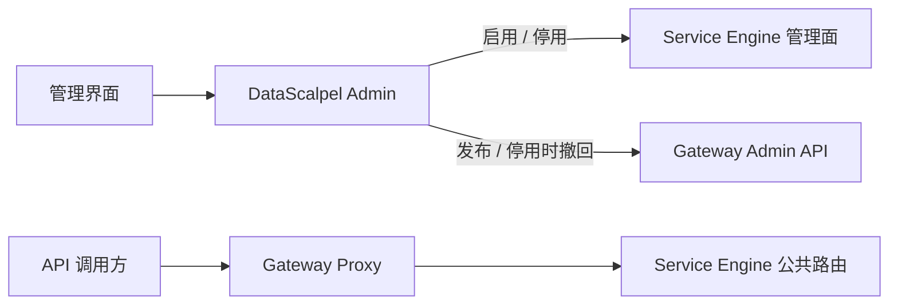
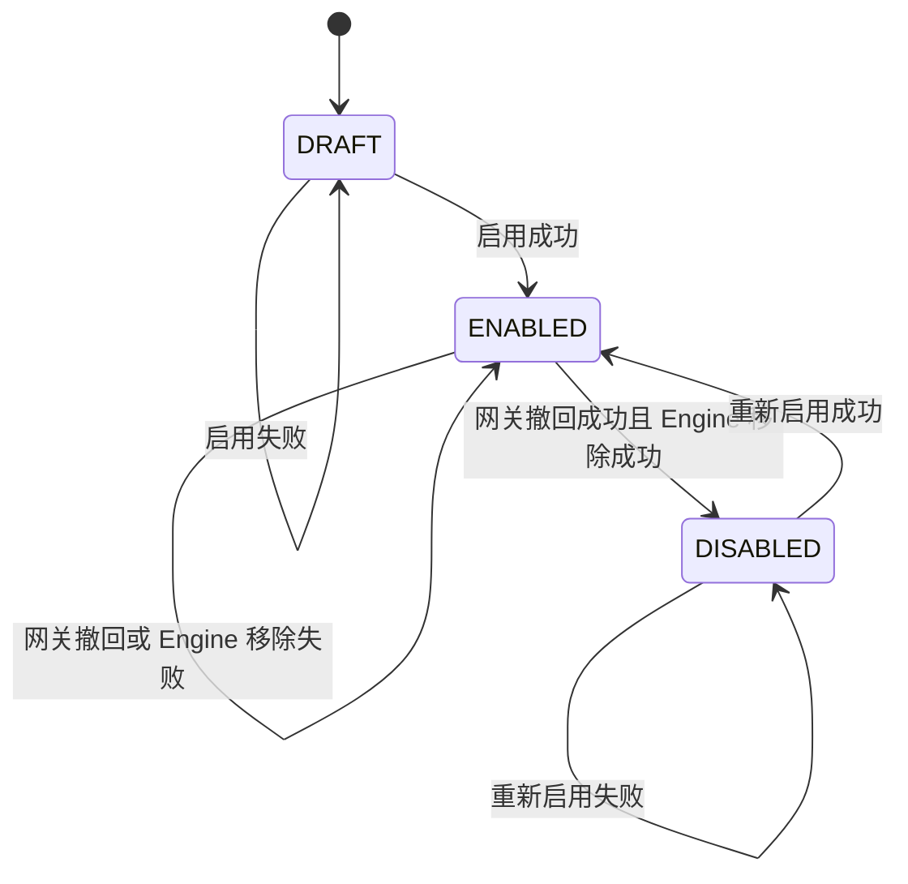

# 数据服务启停与网关发布设计

## 1. 背景

当前数据服务的“发布”操作实际完成以下工作：

1. 校验模型、SQL、物理表和 Engine 数据源注册；
2. 将不可变服务快照部署到 Service Engine；
3. 在 Service Engine 中注册 `/open-api/v1/**` 运行时路由；
4. 将数据服务状态标记为 `PUBLISHED`。

这个语义把“服务已经能在 Engine 内运行”和“服务已经通过统一网关对调用方开放”混在了一起。接入 Kong 后，需要将两层生命周期分离：

- **启用 / 停用**：管理 Service Engine 内的运行态；
- **发布**：把已经启用的服务发布到当前网关，由网关提供统一入口。

API 调用流量仍然不经过 DataScalpel Admin：



## 2. 目标

本阶段实现：

1. 将现有 Engine 部署动作从“发布”改名为“启用”；
2. 保留“停用”，但其含义调整为“先从所有网关安全撤回，再从 Engine 移除”；
3. 新的“发布”只负责将已启用服务发布到当前网关；
4. 提供职责单一的服务发布网关端口，支持后续接入 APISIX 和自研网关；
5. 第一种实现使用 Kong OSS Admin API 创建、更新和删除 Kong Service 与 Route；
6. DataScalpel 保存网关发布主状态，网关对象可通过重试重新同步；
7. 前端分别展示 Engine 运行状态和网关发布状态，访问 cURL 使用网关代理地址；
8. 数据服务声明 `PUBLIC` 或 `SUBSCRIPTION_REQUIRED`，受保护服务发布时同步网关认证和 ACL。

本文不包含：

- 限流、配额、计量、调用审计；
- Kong Upstream、Target、健康检查和多 Engine 负载均衡；
- 多个网关同时作为活动写入目标；
- 单独的“撤回发布但保持 Engine 启用”操作；
- 网关管理面认证。

Consumer、凭证和订阅由独立领域资源及专用网关端口管理，详细设计见
[API 消费者、凭证与服务订阅管理](api-consumer-management.md)。限流和调用统计继续作为独立网关能力设计，不扩张服务发布端口。

## 3. 生命周期语义

### 3.1 数据服务状态

`DataServiceStatus` 调整为：

| 状态 | 含义 | 是否可修改定义 |
|---|---|---|
| `DRAFT` | 从未成功启用的草稿 | 是 |
| `ENABLED` | 当前版本已部署到 Service Engine | 否 |
| `DISABLED` | 曾经启用，现已从 Engine 移除 | 是 |

原数据库中的 `PUBLISHED` 表示旧语义下“已部署到 Engine”，启动时一次性迁移为 `ENABLED`。迁移只修改状态值，不改变 Engine 部署记录和服务 revision。

### 3.2 Engine 部署状态

`DataServiceDeploymentStatus` 保持已有值，语义改为 Engine 运行态：

| 状态 | 含义 |
|---|---|
| `PENDING` | 正在启用或等待确认 |
| `DEPLOYED` | 当前 revision 已部署到 Engine |
| `FAILED` | Engine 启用或停用失败 |
| `REMOVING` | 正在从 Engine 移除 |
| `REMOVED` | 已从 Engine 移除 |

### 3.3 网关发布状态

新增 `GatewayServicePublicationStatus`：

| 状态 | 含义 |
|---|---|
| `PUBLISHING` | 正在创建或更新网关 Service/Route |
| `PUBLISHED` | 当前 revision 已发布到网关 |
| `PUBLISH_FAILED` | 发布失败，可以重试相同服务 |
| `REMOVING` | 停用前正在撤回网关对象 |
| `REMOVE_FAILED` | 撤回失败，服务保持启用 |

Engine 状态和网关状态是两个独立维度。只有同时满足以下条件，服务才拥有可供调用方使用的网关地址：

```text
service.status == ENABLED
AND deployment.status == DEPLOYED
AND gatewayBinding.status == PUBLISHED
AND gatewayBinding.publishedRevision == service.revision
```

## 4. 状态转换



约束：

- `DRAFT`、`DISABLED` 才允许启用；
- `ENABLED + DEPLOYED` 才允许发布到网关；
- `ENABLED` 才允许停用；
- 定义修改只允许在 Engine 已确认移除且不存在网关绑定时进行；
- 删除只允许在非 `ENABLED`、Engine 已确认移除且不存在网关绑定时进行；
- 发布失败不改变 `ENABLED` 状态；
- 停用时只要任何网关撤回失败，就不移除 Engine，避免产生指向已停 Engine 的公开路由。

## 5. 数据模型

### 5.1 GatewayServiceBinding

新增表 `ds_gateway_service_binding`。一个数据服务可以保留多个 Provider 的历史或当前绑定，唯一约束为 `dataServiceId + provider`。

| 字段 | 含义 |
|---|---|
| `id` | UUID 主键 |
| `dataServiceId` | DataService UUID 标量引用 |
| `provider` | `KONG`、后续 `APISIX` 或 `DATASCALPEL` |
| `externalServiceId` | 网关 Service ID |
| `externalRouteId` | 网关 Route ID |
| `publishedRevision` | 最近成功发布的 DataService revision |
| `publicationStatus` | 网关发布状态 |
| `gatewayUrl` | 本次成功发布后提供给调用方的完整地址 |
| `lastError` | 安全、限长的最近错误 |
| `operationStartedAt` | 当前控制面操作开始时间 |
| `publishedAt` | 最近成功发布时间 |
| `createdAt` / `updatedAt` | 统一审计时间 |

`gatewayUrl` 保存发布时快照，而不是查询时根据当前配置临时拼接。这样修改代理地址后，已有发布不会被错误显示为已经迁移；重新发布会刷新该地址。

近期仍处于 `PUBLISHING` 或 `REMOVING` 的操作拒绝重叠执行。超过 30 秒保护窗口后允许人工重试，用于恢复 Admin 进程中断遗留的状态。

### 5.2 路由唯一性

网关入口使用 `DataService.routePath`，因此它必须在整个 DataScalpel 中全局唯一，不再只要求同一 Engine 内唯一：

```text
uk_ds_data_service_route(route_path)
```

应用层在创建、修改时提前检查，数据库唯一约束负责并发兜底。Kong 适配器还会拒绝接管同名但归属标签不匹配的对象。

## 6. 网关薄抽象

通用 Provider 和配置移动到数据服务网关公共包：

```java
public enum GatewayProvider {
    NONE, KONG, APISIX, DATASCALPEL
}

@ConfigurationProperties("data-scalpel.service-gateway")
public record ServiceGatewayProperties(...) {
}
```

消费者、凭证、订阅和数据服务分别使用职责单一的端口，不建立万能 Gateway Client：

```java
public interface GatewayServicePort {

    GatewayProvider provider();

    GatewayServiceResult publish(GatewayServiceSpec service);

    void remove(GatewayServiceReference service);
}
```

其中：

- `GatewayServiceSpec` 包含稳定 DataService ID、code、name、revision、访问模式、网关路径和 Engine 公共基地址；
- `GatewayServiceResult` 返回外部 Service ID、Route ID 和完整网关访问地址；
- `GatewayServiceReference` 包含删除所需的稳定业务标识和外部 ID；
- `GatewayServicePortRegistry` 选择当前写入 Provider，并能按历史 Binding 的 Provider 找到删除适配器。

`GatewayConsumerPort` 只管理消费者，`GatewayCredentialPort` 只管理 API Key，
`GatewaySubscriptionPort` 只管理订阅授权。Kong ACL Group 等 Provider 专属概念不得进入通用 Port。

## 7. Kong 映射

### 7.1 Kong Service

| DataScalpel | Kong Service |
|---|---|
| `dataService.id` | 稳定名称 `datascalpel-service-{UUID}` |
| `engine.publicUrl` | `url` |
| 系统归属 | `tags` |

Service 标签：

- `datascalpel`
- `datascalpel-service`
- `datascalpel-data-service-{dataServiceId}`

第一阶段直接把 Kong Service 指向单个 Engine 的 `publicUrl`，不创建 Kong Upstream 和 Target。

### 7.2 Kong Route

| DataScalpel | Kong Route |
|---|---|
| `dataService.id` | 稳定名称 `datascalpel-route-{UUID}` |
| `dataService.routePath` | `paths` 中唯一值 |
| 固定协议 | `http`、`https` |
| 固定方法 | `POST` |
| 路径转发 | `strip_path=false` |
| Host 行为 | `preserve_host=false` |

Route 使用同一组归属标签。因为 `strip_path=false`，调用：

```text
http://gateway-proxy/open-api/v1/orders
```

会被转发为：

```text
http://service-engine/open-api/v1/orders
```

### 7.3 受保护服务

`SUBSCRIPTION_REQUIRED` 服务在 Kong Service 级配置：

- `key-auth`，只从 `X-API-Key` Header 读取 Key 并隐藏上游凭证；
- `acl`，`allow` 只包含 `datascalpel-service-{dataServiceId}`；
- 两个插件都写入 DataScalpel、插件类型和服务 ID 归属标签。

发布顺序必须 fail-closed：

```text
upsert Service
-> 删除已有 Route，消除公开窗口
-> upsert 并验证 key-auth
-> upsert 并验证 acl
-> 创建 Route
-> 验证 Service、plugins、Route
```

`PUBLIC` 服务只删除 DataScalpel 自己管理的 `key-auth` 和 `acl`，不接管人工或其他系统创建的插件。
服务停用时保留 Subscription 和 Consumer ACL membership；Route 和 Service 删除后数据面不可调用，
重新发布到同一 Provider 后原订阅恢复生效。

### 7.4 归属和幂等

发布：

1. 按稳定名称查询 Kong Service；
2. 不存在则创建；409 后重新读取，处理并发创建；
3. 已存在时必须包含当前 DataService 归属标签，否则拒绝接管；
4. 更新 Service URL；
5. 按稳定名称查询 Route；
6. 不存在则在该 Service 下创建；409 后重新读取；
7. 已存在时校验归属和所属 Service；
8. 更新 Route 路径与固定策略；
9. 返回两个外部 ID 和 `proxyUrl + routePath`。

撤回：

1. 优先按 Binding 保存的 Route ID 查询，缺失时按稳定名称查询；
2. 校验 Route 归属后删除，404 视为成功；
3. 再按 Binding 保存的 Service ID 查询，缺失时按稳定名称查询；
4. 校验 Service 归属后删除，404 视为成功；
5. 任一归属不匹配时拒绝删除。

删除顺序固定为 Route 后 Service，避免 Service 仍被 Route 引用。发布或撤回发生部分成功时，稳定名称和标签确保下次重试可以继续收敛。

第一阶段不发送 Kong Admin 认证 Header。生产部署必须通过内网隔离或后续明确的管理面认证保护 `admin-url`。

## 8. 控制面流程

### 8.1 启用

启用沿用现有安全部署流程，只修改命名和最终状态：

```text
只读短事务：读取并校验服务、模型、SQL、Engine 和数据源注册
-> 事务外：检查物理表或 SQL
-> 短事务：冻结快照，写 Engine PENDING，生成/复用 revision
-> 事务外：调用 Service Engine deploy
-> 短事务：写 DEPLOYED + ENABLED，或写 FAILED
```

接口：

```text
POST /api/v1/data-services/{id}/actions/enable
```

同一快照处于 `PENDING` 或 `FAILED` 时允许重试并复用 revision；不同快照必须先清理不确定部署。

### 8.2 发布到网关

```text
短事务：
  锁定 DataService
  校验 ENABLED + Engine DEPLOYED + revision 一致
  选择当前 Provider
  创建或锁定 Binding
  写 PUBLISHING
-> 事务外：
  GatewayServicePort.publish
-> 短事务：
  操作令牌和 revision 未变化时
  写 PUBLISHED，或写 PUBLISH_FAILED
```

接口继续使用：

```text
POST /api/v1/data-services/{id}/actions/publish
```

重复发布当前 revision 是合法的“重新同步”，用于恢复网关对象被人工删除、代理地址变化或失败状态。

数据服务的只读手动对账、漂移状态和显式重新发布边界见
[手动网关状态对账与显式重新同步](manual-gateway-reconciliation.md)。

### 8.3 停用

```text
短事务：锁定服务和所有 Binding，写 REMOVING
-> 事务外：逐个 Provider 删除 Route 和 Service
-> 每个 Binding 一个短事务：
     成功则删除 Binding
     失败则写 REMOVE_FAILED
-> 任一 Binding 失败：
     停止流程，服务保持 ENABLED，Engine 保持 DEPLOYED
-> 所有 Binding 成功：
     短事务写 Engine REMOVING
     -> 事务外调用 Service Engine remove
     -> 短事务写 REMOVED + DISABLED，或写 FAILED
```

接口保持：

```text
POST /api/v1/data-services/{id}/actions/disable
```

停用兼具撤回发布职责。本阶段不提供单独的 `unpublish` Action。

### 8.4 清理失败的 Engine 部署

接口保持：

```text
POST /api/v1/data-services/{id}/actions/cleanup-deployment
```

它只处理未成功启用时的 Engine `PENDING` / `FAILED` 状态。网关发布失败通过再次“发布”修复，或通过“停用”清理残留网关对象。

## 9. REST 响应

`DataServiceDetailResponse` 和 `DataServiceSummaryResponse` 增加：

```json
{
  "gatewayBindings": [
    {
      "id": "uuid",
      "provider": "KONG",
      "externalServiceId": "kong-service-id",
      "externalRouteId": "kong-route-id",
      "publishedRevision": 3,
      "publicationStatus": "PUBLISHED",
      "gatewayUrl": "http://10.0.0.5:8000/open-api/v1/orders",
      "lastError": null,
      "operationStartedAt": null,
      "publishedAt": "2026-07-25T12:00:00Z"
    }
  ]
}
```

已有 Engine 字段继续保留：

- `deploymentStatus`
- `deploymentError`
- `deployedAt`

成功响应继续直接返回 DTO；错误继续使用 RFC 9457 Problem Detail。远程 Kong 错误只保存安全的 HTTP 状态和 Kong `message/name`，不泄露未知响应字段。

## 10. 前端交互

详情页和列表分别展示：

- 服务状态：草稿、已启用、已停用；
- Engine 状态：启用中、已部署、启用/停用失败、停用中、已移除；
- 网关状态：发布中、已发布、发布失败、撤回中、撤回失败。

操作：

| 条件 | 操作 |
|---|---|
| 草稿或已停用，Engine 无未清理状态 | 启用 |
| Engine `PENDING` / `FAILED` | 重试启用、清理 Engine 部署 |
| 已启用 | 发布 |
| 网关发布失败 | 重试发布 |
| 已启用，无论是否已发布 | 停用 |
| 网关已发布 | 复制网关访问 cURL |

“复制 cURL”使用 Binding 中的 `gatewayUrl`，不再使用 Engine `publicUrl`。这样用户拿到的地址一定经过统一网关。

## 11. 并发、失败和恢复

- DataService 和 Binding 控制面准备阶段使用悲观锁；
- 外部 HTTP 调用不进入管理数据库事务；
- `operationStartedAt` 作为一次操作令牌，完成阶段只更新仍属于本次操作的状态；
- 30 秒内的进行中操作拒绝重叠执行，超时后允许人工重试；
- 发布部分成功后可以通过稳定 Kong 名称重新收敛；
- 撤回部分成功后只保留失败 Binding，重试不恢复已经删除的对象；
- 网关撤回失败时不停止 Engine；
- Engine 停用失败时网关已撤回，服务仍标记 `ENABLED`，再次停用只需继续移除 Engine；
- Provider 配置变更后，新发布写入当前 Provider；停用会按 Binding 中保存的 Provider 清理所有历史对象。

## 12. 配置

继续复用：

```yaml
data-scalpel:
  service-gateway:
    provider: kong
    kong:
      admin-url: http://10.0.0.5:8003
      proxy-url: http://10.0.0.5:8000
      connect-timeout: 3s
      request-timeout: 5s
```

`provider=none` 时：

- Consumer 网关同步不可用；
- API Key 和订阅网关同步不可用；
- 数据服务“发布”返回 503；
- 数据服务启用仍可使用；
- 停用没有历史网关 Binding 时仍可使用；
- 停用存在历史 Binding 时需要对应 Provider 适配器可用，以确保公开路由被安全撤回。

## 13. 验收范围

自动化测试至少覆盖：

1. 旧 `PUBLISHED` 状态迁移为 `ENABLED`；
2. 启用成功、失败重试和 Engine 清理；
3. 未启用服务拒绝发布到网关；
4. 发布成功保存 Service ID、Route ID、revision 和网关 URL；
5. 发布失败保存安全错误并允许重试；
6. Kong 创建、更新、并发 409、归属冲突和 404 幂等；
7. 停用先删除网关 Route/Service，再移除 Engine；
8. 网关撤回失败时 Engine 不被移除；
9. 全局路由路径冲突；
10. 前端按钮、访问模式、状态标签、网关 cURL 和错误提示；
11. 受保护发布按 fail-closed 顺序配置 `key-auth + acl`；
12. 存在订阅时禁止将受保护服务改成公开访问。

真实 Kong 联调：

1. 启用一个临时 `SUBSCRIPTION_REQUIRED` 数据服务；
2. 发布到 Kong；
3. 校验 Kong Service、Route、`key-auth`、`acl`、路径、上游 URL 和标签；
4. 无 Key 调用返回 401；
5. 有效 Key 未订阅返回 403；
6. 创建订阅后调用返回 200；
7. 撤回订阅后再次返回 403；
8. 停用服务；
9. 确认 Kong Route、Service 和 DataScalpel Binding 均已删除；
10. 清理临时 Consumer、Credential、Subscription、DataService 和网关对象。
