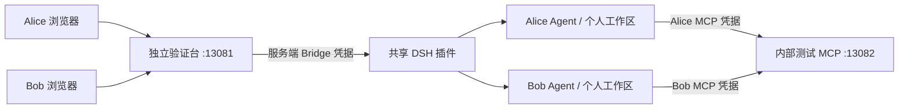

# DSH 第二阶段：独立多用户验证台

状态：已实现并完成当前受控能力范围的双用户运行验证。阶段三 Admin 接入、阶段四业务页面闭环仍待后续设计。本阶段不使用 DataScalpel 登录、业务 API、系统 MCP 或 Skills。

## 1. 实际范围

一个现有 DSH 实例，两名固定验证用户 `alice` / `bob`，独立验证台供人工使用。源码分别位于 `integrations/dsh-plugin/` 和 `integrations/dsh-playground/`，插件保持 DSH 公开扩展方式；不修改核心或已安装发布包。



验证台采用 Node.js 24 内置 HTTP 与静态页面，依赖当前项目已有的 MCP SDK 1.30.0 和 ws 8.21.3。没有新数据库、前端框架、Maven 模块或与 DataScalpel 的代码依赖。页面包含登录、会话列表、流式聊天、工具记录、追问、取消、恢复及个人文本文件浏览编辑。

## 2. 身份与信任边界

- 固定用户及随机密码由本地部署配置提供，首次初始化生成，仓库只有占位样例。后端内存中使用带随机盐的 scrypt 摘要比较登录密码。
- 浏览器持有随机、不含用户信息的 HttpOnly / SameSite=Strict Cookie，有效期 12 小时；HTTPS 配置下追加 Secure。服务重启需要重新登录；退出和过期关闭相关事件连接。
- 后端只从认证会话取得用户，不信任请求体、查询参数或自定义身份头；前向请求固定到配置的 DSH 地址，不转发浏览器认证头、Cookie、Origin 或任意路径。
- HTTP 拒绝跨站 Origin，WebSocket 必须匹配验证台公开 Origin；登录有短期尝试次数上限。
- `/bridge/v2/users/alice` 与 `/bridge/v2/users/bob` 是仅可信后端使用的插件路由，全部需要 Bridge Bearer。路由选定固定的用户服务实例，不允许传入工作目录。相同凭据可访问两个用户，因而 Bridge 本身是受信任边界，不可交给普通用户。
- 原生页面保留给可信操作者，具备管理整个 DSH 的能力；第二阶段不声称在原生管理员、恶意 root 或任意进程面前隔离。

## 3. 归属、生命周期与文件

每位用户首次进入验证台，后端调用工作区 ensure，插件先创建 `/workspace/bridge-phase-two/{alice|bob}`，再注册原生 Workspace。重复执行复用工作区。用户可创建多个对话。

原生会话与历史仍由 DSH 持久化。插件控制数据分别使用 `datascalpel_bridge_alice` / `datascalpel_bridge_bob` 存储域；原阶段一 `datascalpel_bridge` 保持独立。已知别人的 session ID 不会授予访问权：详情、历史、消息、恢复、取消、追问、事件升级均先查当前用户存储域。

复用阶段一 Sessions / Events / Interactions 实现：客户端消息 UUID 幂等去重、每会话控制串行、持久化屏障、显式恢复、追问失效、取消、断线不断任务。用户各有最多 4 个活跃 Agent，第一阶段原有 4 个额度独立，故插件验证总上限 12 个；模型并发及额度仍受提供方约束。暂无空闲回收，达到容量可重启 DSH 后按需恢复。

DSH 当前 `dsh-fs-sandbox` 的公开实现中读取直通，`workspace-write` 主要控制写入，因此不将它作为跨用户读取隔离依据。第二阶段用两种受控工具实现文件边界：

| 工具 | 契约 |
| --- | --- |
| `workspace_read` | `{path}`：空字符串列根目录，相对目录列子项，相对文件读取 UTF-8 文本 |
| `workspace_write` | `{path,text}`：在个人工作区创建或覆盖文本，必要时创建子目录 |

同一实现用于 HTTP 文件面板。拒绝绝对路径、`..`、`.`、反斜线、NUL、符号链接、硬链接、特殊文件；最终打开使用 no-follow，文本最多 128 KiB，目录最多 200 项，过大返回错误而不截断伪装完整。文件操作按用户串行。

此处属于可信进程中的路径检查，未提供抵御其他进程同时替换父目录的内核隔离。Agent 没有任意代码执行、创建链接或跨目录通道，不能把这一结论推广到启用原生 Shell / 全局文件工具后的安全性。

## 4. MCP 身份验证

独立测试 MCP 在验证台容器内部监听 `13082`，不发布到宿主机，不依赖 DataScalpel。通过 SDK 提供无状态 Streamable HTTP，唯一只读工具 `whoami` 不接收用户参数，返回：

```json
{"authenticatedUser":"alice","requestId":"随机请求标识","source":"independent-test-mcp"}
```

身份来自 MCP 服务实际校验的专用 Bearer，Alice/Bob 凭据独立，不由 LLM 自报。Agent `setup` 时使用当前发布版 `dsh-mcp-client` 公共 `apply` 在会话作用域中建立客户端，固定该用户的认证头，生命周期随 Agent 释放。模型可见名称包含会话命名空间，不把令牌放入工具定义或会话消息。

不修改全局环境或共享客户端认证头；两名用户同时调用也各自使用固定凭据。恢复会话重新加载当前配置凭据并建立连接。服务重启或启动错误由原生客户端处理；初始 MCP 不可用时拒绝发布未就绪 Agent。

独立 Preset `datascalpel-bridge-phase-two` 组装 persona、原生 ask_user_question、会话范围内 compaction，再挂载上述 MCP 与文件工具。`tools.restrict` 只过滤全局工具；会话局部注册保留。发布 Agent 前检查实际可见工具名称与预期完全一致。

## 5. HTTP 与事件接口

验证台接口：

| 接口 | 行为 |
| --- | --- |
| `POST /api/login` | `{username,password}`，设置认证 Cookie |
| `GET /api/me` | 当前固定用户与受控工具边界说明 |
| `POST /api/logout` | 注销 Cookie 会话、关闭该登录的事件连接 |
| `/api/bridge/*` | 下表中的受控代理路径，后端派生 owner |
| WebSocket `/events?sessionId=...` | 后端先让插件校验会话归属，成功才升级浏览器连接 |

插件内部路径前缀为 `/bridge/v2/users/{固定用户}`。除新增文件入口外，请求/响应沿用[阶段一契约](dsh-plugin-phase-one.md)：

- `GET /capabilities`，`POST /workspaces/actions/ensure`。
- `GET/POST /sessions`，`GET /sessions/{id}`。
- `GET/POST /sessions/{id}/messages`，列表支持 offset/limit。
- `POST /sessions/{id}/actions/resume`、`cancel`。
- `POST /sessions/{id}/interactions/{interactionId}/actions/respond`。
- WebSocket `/events?sessionId=...`。
- `GET /files?path=...`：目录 `{kind,path,entries}` 或文本 `{kind,path,text}`。
- `POST /files`：`{path,text}`，返回 `{path,saved:true}`。

失败保持 ProblemDetail 与稳定 code。跨用户会话统一 404；追问失效 410；会话忙 409；超出容量 503；文件格式及路径错误 400/403/415；超预算 413。后端无法确认提交结果时不自动重试写操作，页面保留消息 ID，用户可先刷新历史。

实时事件为下行专用，不接收客户端命令。插件和代理发送缓冲均有界，慢消费者关闭连接要求重新同步。页面重连先读取当前状态和完整持久历史；短暂增量不承诺重放。模型生成过程与页面连接生命周期无关。

## 6. 运维与验收

配置、启动、账号与人工检查步骤见 [验证台 README](../../integrations/dsh-playground/README.md)。仅使用现有 DSH Docker，不启动 DataScalpel 或另一套 DSH。Compose 新增 playground 服务，共享内部网络；独立持久用户数据仍归现有 DSH 卷。

验收覆盖双用户并发真实模型与 MCP、同名文件互不混用、HTTP 和 WS 越权、模型实际文件工具越界、原生追问独立回答/取消、消息去重、断线重连、重启恢复以及现有原生数据保留。实际执行结果在[验证记录](dsh-plugin-phase-two-verification.md)中维护。

本阶段完成仅证明上述受控能力边界；DataScalpel 用户身份与 RBAC、真实系统 MCP、第三方 Skills、任意 Shell 和面向不可信租户的隔离均未验证，仍须后续专项设计。
