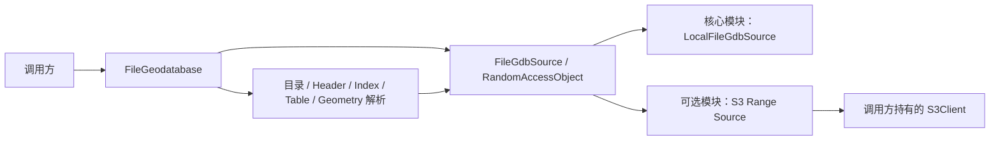

# FileGDB Reader 本地与 S3 双来源设计

## 1. 定位

本设计在 `data-scalpel-filegdb` 第一阶段格式解析能力之上增加存储来源抽象，使目录、Schema、属性和 Geometry 解析代码同时读取本地已解包 `.gdb` 与 S3 已解包对象前缀。

这两个模块仍是独立解析组件，不接入 Business、Admin、文件数据集、Spring、对象存储业务配置或 REST API。本文实施时 ZIP、内部压缩表和新增 Geometry 类型不在存储解耦范围；后续核心已经增加 MultiPoint 与 Polyline，S3 适配器无需专用解析逻辑即可读取这些类型。

## 2. 模块边界

- `data-scalpel-filegdb`：纯 JDK 核心、来源 SPI、本地来源和格式解析，运行时第三方依赖为零。
- `data-scalpel-filegdb-s3`：依赖核心与 AWS SDK v2 S3，同步读取；明确排除 CRT 和 Netty 异步客户端。
- `S3Client` 由调用方配置和关闭。数据库只取得 `FileGdbSource` 所有权，不取得客户端所有权。

`FileGeodatabase.open(Path, options)` 保持本地兼容入口；`open(FileGdbSource, options)` 是统一入口。`sourceInfo()` 返回安全的位置标识。本地专属 `directory()` 不再存在，`allowSymbolicLinks` 只影响本地来源。

## 3. 随机读取契约

`FileGdbSource` 只接受解析器生成的单个物理文件名，来源实现拒绝斜杠、反斜杠、`.`、`..` 和控制字符。`FileGdbRandomAccessObject.read(position, target)` 是位置无关读取，不共享可变游标。

核心 `LittleEndianRandomAccessReader` 统一负责：

- 文件大小与 `maxTableFileBytes`；
- 负偏移、加法溢出和越界；
- 短读、提前 EOF 和零进展；
- 小端 `ByteBuffer`；
- 解析异常时关闭对象。

本地来源使用独立只读 `FileChannel.read(target, position)`，保留目录边界、真实路径和符号链接检查。S3 来源把相同读取拆为对齐的数据块。

## 4. S3 请求与缓存

S3 位置由 bucket 和规范化后的 `.gdb` prefix 组成。适配器不列举对象；解析器依次检查 `gdb` 标记、系统目录和目录实际引用的表/索引对象。

每个来源维护：

- 对象元数据与缺失对象缓存；
- 以“对象 Key + VersionId/ETag + 块号”为 Key 的访问顺序 LRU；
- 默认 1 MiB 块、64 MiB 总上限。

缓存未命中时只发起精确 `bytes=start-end` Range GET，最后一块按对象真实长度截断。响应体长度、`Content-Length` 和 `Content-Range` 必须完全匹配请求；失败块不会进入缓存。来源关闭时同步清空全部缓存，不创建临时文件或后台任务。

## 5. 一致性与失败

S3 前缀发布后视为不可变。对象有 VersionId 时后续请求固定该版本；没有 VersionId 时使用 HEAD 得到的 ETag 和 `If-Match`。成功响应仍会复核版本与 ETag。

稳定错误映射如下：

- 缺失对象：`MISSING_FILE`；
- 版本或 ETag 变化、412：`SOURCE_CHANGED`；
- Range 越界、416、短响应：`TRUNCATED_INPUT`；
- 对象超过限制：`LIMIT_EXCEEDED`；
- 权限、网络、超时和服务端错误：`IO_ERROR`。

VersionId/ETag 只能保证单个对象读取一致。多个对象的原子发布由调用方通过新前缀或版本化发布流程保证。

## 6. 生命周期

数据库成功或失败打开后都拥有并关闭来源。正常关闭顺序是尚未关闭的游标、来源；多个关闭异常使用 suppressed exception 保留。来源和对象关闭幂等。S3 来源关闭不调用 `S3Client.close()`。

数据库、游标和来源不承诺线程安全；本阶段没有异步预取、并发 Range 或后台线程。

## 7. 验证

- 核心生成夹具分别通过本地、内存来源和 S3 来源读取并比较公开结果；
- 可控 S3 替身验证块边界、共享缓存、LRU、失败不入缓存及所有错误码；
- SDK 请求捕获验证 VersionId、If-Match 与精确 Range；
- JDK 本地 HTTP 端点使用真实同步 `S3Client` 完整读取夹具，并拒绝任何无 Range GET；
- 默认跳过的真实 AWS S3/MinIO 测试只读已有前缀；
- 依赖树门禁确认核心零运行时依赖，S3 模块无 CRT、Netty/JNI/JNA 或平台分类器。
