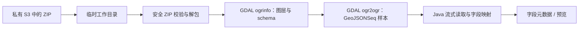

# SHP 与 FileGDB 文件数据集解析设计

> 状态：设计冻结，暂不开发。该能力排在文件数据集其他非空间能力之后，作为最后的空间数据阶段实施。当前工程继续允许保存 SHP/FileGDB 解析参数，但不开放真实解析。

## 决策与范围

本阶段在现有“上传到平台私有 S3、保存解析参数、显式执行同步抽样解析”的文件数据集流程中，实现 `SHP` 与 `GDB` 的**矢量要素层**抽样解析。原始 ZIP 始终按原样保存在对象存储；解析只生成字段元数据和最多 1,000 条预览样本，不创建空间索引、地图服务、坐标转换任务或物理表。

采用 GDAL/OGR 命令行运行时作为唯一空间格式引擎，不为 SHP 引入一套 Java GIS 库、又为 FileGDB 引入另一套原生实现。GDAL 的 ESRI Shapefile 驱动支持 SHP/DBF/PRJ/CPG 组合文件与编码覆盖；OpenFileGDB 驱动支持 ArcGIS 10+ FileGDB、ArcGIS 9.x 的只读访问以及直接读取 `.gdb.zip`。参考 [Shapefile 驱动文档](https://gdal.org/en/stable/drivers/vector/shapefile.html) 和 [OpenFileGDB 驱动文档](https://gdal.org/en/stable/drivers/vector/openfilegdb.html)。

这个选择新增的是**部署运行时依赖**（`ogrinfo`、`ogr2ogr`），不是 Maven Java 依赖，也不把 JNI、GDAL native binding 或容器控制代码放进业务模块。部署镜像/服务器必须提供同一套 GDAL 工具；建议固定 GDAL 3.10 以上的版本并在交付环境实际验证驱动可用性。

第一版边界：

- `SHP` 仅接收 `.zip`，其中包含一个或多个完整 Shapefile 图层；每个图层至少应有同名 `.shp`、`.shx`、`.dbf`，`.prj`、`.cpg` 可选。
- `GDB` 仅接收 `.zip`，其中包含一个 `.gdb` 目录。只读取矢量 feature layer，不读取 FileGDB raster、附件、关系类、拓扑和域定义。
- 一次只解析一个图层。未填写图层名且源中只有一个矢量图层时自动选择；多个图层时解析失败并返回可选择的图层名，用户在现有“图层名称”配置中填写后重试。
- 不支持密码保护 ZIP、损坏的 ZIP、加密数据集和需要 ESRI FileGDB SDK 才能读取的压缩变体。

## 用户交互和 API

不新增资源类型或版本表，沿用已有 API：

1. 用户创建 `SHP` 或 `GDB` 文件数据集，上传 ZIP。
2. 在“解析设置”抽屉填写参数：SHP 填字符集（默认 UTF-8）和可选图层名；FileGDB 只填可选图层名。
3. 用户执行解析。图层未明确且存在多个可选项时，状态写为 `FAILED`，错误文本列出图层名；用户更新参数后再次执行。
4. 成功后状态为 `READY`，抽屉使用既有预览 API 展示字段和最多 100 条记录。

不新增“图层发现”接口。对第一版而言，多图层时直接把可选名称作为明确、可操作的错误返回，能保持 API 和前端交互简单；后续若多图层选择成为高频场景，再增加只读的图层发现 API，并把文本输入替换为 Select。

## 解析架构

在 `data-scalpel-business.filedataset.service.parse` 增加一个职责集中的 `GdalVectorFileDatasetParser`，同时支持 `SHP` 和 `GDB`，并声明 `LOCAL_FILE` 输入模式。它不依赖 Web request/response DTO；`FileDatasetService` 在边界处将已有的 `Shapefile`、`FileGdb` 参数转换为内部 `Vector` 解析配置。

解析器内部只使用两个小型协作类：

- `VectorArchiveExtractor`：检查 ZIP central directory，再解包到当前解析专用工作目录。
- `GdalCommandRunner`：以 `ProcessBuilder(List<String>)` 执行 `ogrinfo` 和 `ogr2ogr`，不通过 shell 拼接命令。

临时文件管理器扩展为创建“单次解析工作目录”，并在结束时递归删除。对象存储下载的 ZIP、解包内容、GDAL 产出的 GeoJSONSeq 样本都只能位于该目录中；异常时也在 finally 块清理，遗留目录由现有过期清理策略兜底。

GDAL 通过其 `/vsizip/` 虚拟文件系统可以直接访问 ZIP 内文件，但第一版仍先安全解包：这样可以在调用外部进程前统一限制 ZIP 条目、路径和解压大小，并为 Shapefile 的同名 sidecar 校验提供稳定路径。GDAL 的 ZIP 虚拟文件系统能力见 [官方文档](https://gdal.org/en/stable/user/virtual_file_systems.html)。

## 命令与进程约束

执行顺序如下：

1. `ogrinfo` 以只读、schema-only、JSON 输出检查数据集，取得所有矢量图层、字段类型和可空性。
2. 根据配置选择图层；若没有唯一选择，构造带图层名称的业务错误，不执行样本转换。
3. `ogr2ogr` 将选定图层转换为本地 `GeoJSONSeq` 文件，限制导出量为 `recordLimit + 1`。GeoJSONSeq 是逐条 Feature 的 JSON 序列，适合由 Java 流式处理；GDAL 的该驱动为内置驱动，并支持增量 Feature 序列输出，见 [GeoJSONSeq 文档](https://gdal.org/en/stable/drivers/vector/geojsonseq.html)。
4. Java 使用 Jackson 逐条读取 GeoJSON Feature，以第 1,001 条判断 `truncated`，不把整个要素集合读入内存。

应用配置新增到 `data-scalpel.file-parsing.gdal`：

| 配置项 | 环境变量 | 默认值 | 含义 |
| --- | --- | --- | --- |
| `ogrinfo-command` | `DATASCALPEL_GDAL_OGRINFO_COMMAND` | 空 | `ogrinfo` 的绝对路径；为空时明确报“空间解析运行时尚未配置”。 |
| `ogr2ogr-command` | `DATASCALPEL_GDAL_OGR2OGR_COMMAND` | 空 | `ogr2ogr` 的绝对路径。 |
| `execution-timeout` | `DATASCALPEL_GDAL_EXECUTION_TIMEOUT` | `60s` | 单次 GDAL 子进程最长运行时间。 |
| `max-process-output-size` | `DATASCALPEL_GDAL_MAX_PROCESS_OUTPUT_SIZE` | `1MB` | 诊断输出最大捕获量，防止异常输入撑满内存。 |

安全要求：可执行路径只能来自应用配置；数据集路径来自受控临时目录；图层名作为单独参数传入；不接收调用方提供的命令、GDAL 配置、SQL 或输出路径。超时后终止进程，标准错误截断后写入受控的解析失败信息，不暴露服务器绝对路径。

## 字段与样本映射

`ogrinfo` 的图层 schema 是字段契约来源，GeoJSONSeq 只提供抽样值：

| OGR 字段类型 | 文件数据集逻辑类型 |
| --- | --- |
| Integer / Integer64 | `INTEGER` |
| Real | `DECIMAL` |
| String / WideString | `STRING` |
| Date | `DATE` |
| Time | `TIME` |
| DateTime | `DATETIME` |
| Binary | `BINARY`（Base64 预览） |
| List / 结构化或未知值 | `ARRAY` 或 `JSON` |

每条样本记录由属性字段和一个几何字段组成。几何字段默认名为 `geometry`、类型为 `JSON`，值是紧凑 GeoJSON 文本；如源属性已使用该名称，则按现有字段重名规则追加后缀。GeoJSON 输出为互操作预览格式，几何会按 GDAL 的 GeoJSONSeq 行为转换为 WGS84；原始坐标与原始文件始终保留在对象存储中。本阶段不新增 CRS、extent 或几何类型的持久化元数据。

## ZIP 校验

在解包前读取 ZIP 条目元数据并执行以下检查：

- 拒绝空 ZIP、绝对路径、包含 `..`、NUL 字符或规范化后逃出工作目录的条目。
- 限制最大条目数和累计解压大小；累计解压上限使用现有 `max-materialized-size`，避免 ZIP bomb。
- SHP 图层按同名 `.shp/.shx/.dbf` 组合识别；配置图层名必须匹配候选名称。
- GDB 必须且只能包含一个可识别的 `.gdb` 根目录；拒绝 ZIP 中多个 GDB 或混杂的逃逸路径。

## 测试与验收

- 单元测试：ZIP 路径逃逸、解压上限、Shapefile/GDB 图层选择、GDAL schema 类型映射、GeoJSON Feature 到预览行的转换、进程超时和诊断输出截断。
- 后端集成测试：使用固定 SHP ZIP 与 GDB ZIP 夹具，覆盖单图层、多个图层、中文 DBF 编码、空几何、日期数值和解析失败状态。
- 真实 GDAL 验证：单独的 opt-in 测试 Profile 在已安装 GDAL 的环境运行，执行 `ogrinfo --version` 和两种实际夹具。默认 `./mvnw verify` 不依赖本机 GDAL，以保持开发与 CI 可重复；发布镜像验证必须启用该 Profile。
- 前端：SHP/GDB 的解析按钮在配置完成后可用；多图层错误可见且能通过修改“图层名称”重试。

## 最后阶段的实施顺序

本设计进入实施时按以下顺序推进，每一步完成并验证后再进入下一步：

1. **确认运行方式**：确认交付环境采用固定版本 GDAL/OGR 命令行，确定 Linux/容器镜像中的安装方式、命令绝对路径和版本检查策略。
2. **临时工作区与 ZIP 安全**：先实现单次解析工作目录、受限解包、路径逃逸防护、条目数/解压大小限制和异常清理，不接 GDAL。
3. **GDAL 进程适配**：实现只读命令执行、超时、输出限流、进程终止和错误归一；用受控假命令完成自动化测试。
4. **图层与 schema 发现**：解析 `ogrinfo` JSON，完成单图层自动选择、多图层错误提示、OGR 类型到平台逻辑类型的映射。
5. **样本解析**：用 `ogr2ogr` 生成受限 GeoJSONSeq，流式转换为字段与预览行，接入现有解析状态和字段持久化流程。
6. **前端开放**：后端通过真实夹具验证后，再开放 SHP/GDB 的“执行解析”按钮；此前仍只允许保存参数。
7. **交付验证**：使用固定 SHP/FileGDB 夹具运行默认测试，并在真实 GDAL 环境运行 opt-in 验证；最后执行 `./mvnw verify` 和 `pnpm check`。

空间能力实施期间仍不引入空间物理表、坐标系管理、地图服务和空间任务节点；这些属于独立业务阶段，不能借文件预览解析顺带扩张。

## 需要确认

进入最后的空间数据阶段时，再确认是否以 **GDAL/OGR 命令行作为部署前置条件**。该决策意味着部署镜像或内网服务器需安装固定版本的 GDAL，但能够以一个稳定的引擎统一支持 SHP 与 FileGDB，并避免将大量 Java GIS 依赖或平台相关 JNI 放进模块化单体。在此确认之前不增加生产依赖、不创建解析器，也不开放前端执行入口。
