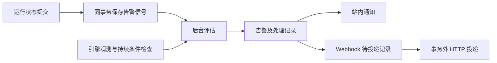

# 全局运行工作台与告警 V1

状态：V1 已实现。覆盖批任务、实时任务、模型质检与计算引擎，提供站内通知与通用 Webhook。失败事件按单次运行保留并人工关闭；后续成功不自动关闭原失败。

适用范围：DataScalpel 控制面的运行查询、告警管理与通知。遵循 [根开发约定](../../AGENTS.md)、[前端规范](../../data-scalpel-ui/AGENTS.md)、[任务执行规范](../development/task-engine.md)及 [系统访问管理](system-access-management.md)。

## 1. 已确认范围与目标

| 项目 | 决策 |
| --- | --- |
| 监控对象 | 批任务、实时任务、模型质检、计算引擎 |
| 通知渠道 | 站内通知 + 通用 Webhook |
| 产品目标 | 发现异常 → 定位原因 → 调用已有处理操作 → 确认处理结果 |
| 实现位置 | Business `operations` 包与 UI `modules/operations`，不新增运行服务或依赖 |

批任务包含 Local SQL、Spark Canvas、Spark JAR 和模型质检；实时任务包含实时 Canvas 和实时 JAR。文件解析、数据服务、服务引擎、网关请求告警在后续阶段评估。现有 [网关运维统计](gateway-operations-dashboard.md)保留自己的范围。

第一版聚焦固定规则类型、明确阈值和可靠通知。任务依赖、补数、自动重跑、自动重启、自动扩缩容、通用规则表达式、值班排班、邮件和多级升级不属于本次范围。

## 2. 现有能力与接入边界

| 来源 | 可以复用 | 设计注意事项 |
| --- | --- | --- |
| TaskRun | 状态、任务类型、引擎、时间、触发方式、质量汇总、安全错误 | 新增全局分页入口；只读列表不解析完整定义或下载 Result |
| Streaming Deployment / Query | 部署状态、当前运行、吞吐、最近进度、来源延迟 | 主列表按当前部署展示，Query 是详情；无数据与无进度不能直接等同故障 |
| ComputeEngine / Dispatcher | 注册状态、运行概览、容量使用、依赖就绪情况 | 现有概览按请求访问 Dispatcher；全局工作台需要后台观测快照 |
| 前端运行详情 | 详情 Drawer、日志、结果、血缘、样本、取消与强制终止 | 从 task 模块公开入口复用，保留原权限及后端状态校验 |
| 执行 Inbox / Outbox | 事务内记录事实、异步处理、批次领取 | 借鉴现有可靠投递方式；告警信号与执行命令使用不同业务记录 |

关键代码入口：[TaskRunResponse](../../data-scalpel-business/src/main/java/cn/superhuang/data/scalpel/business/task/web/response/TaskRunResponse.java)、[实时部署响应](../../data-scalpel-business/src/main/java/cn/superhuang/data/scalpel/business/task/web/response/TaskStreamingDeploymentResponse.java)、[引擎运行查询](../../data-scalpel-business/src/main/java/cn/superhuang/data/scalpel/business/compute/service/ComputeEngineRuntimeService.java)、[执行事件应用](../../data-scalpel-business/src/main/java/cn/superhuang/data/scalpel/business/task/execution/service/DispatcherEventApplicationService.java)、[Local SQL Worker](../../data-scalpel-business/src/main/java/cn/superhuang/data/scalpel/business/task/service/TaskRunWorker.java)。

实时 Deployment 的失败处理会把 desiredState 改为 STOPPED，因此不能仅用“期望运行但实际停止”判断异常退出。应依据运行失败事实及错误分类，正常 STOPPED/CANCELLED 继续按原有语义处理。

## 3. 页面与交互

“运行中心”菜单，提供三个入口：运行工作台、告警中心、告警配置。首页只增加真实运行摘要与待处理入口，与工作台共用查询能力。

### 3.1 运行工作台

| 页签 | 主要内容 |
| --- | --- |
| 概览 | 当前排队/运行、未关闭告警、最近 24 小时完成和失败、质量不通过、需要关注的实例及引擎 |
| 运行实例 | 跨任务分页列表；名称、类型、目录、引擎、状态、触发方式、时间、运行模式筛选 |
| 实时任务 | 当前部署、运行状态、持续时间、最近进度、吞吐、来源延迟、最近错误；展开查看 Query |
| 计算引擎 | 注册状态、连通性、容量、排队、依赖就绪、观测时间；进入已有引擎详情 |

运行列表主身份合并任务名称、类型和运行 ID；其余列展示状态/质量结论、触发来源、引擎、时间/耗时和紧凑行操作。详细错误、诊断 ID、节点、日志和制品放在详情中。对象已删除时保留历史身份，相关跳转明确不可用。

活动实例默认不受历史时间窗口限制，避免遗漏长期排队和长期运行。历史列表默认按提交时间查询，支持明确切换到结束时间；从趋势图进入列表时自动使用结束时间过滤。

取消、正常停止、强制终止按现有能力展示，实际请求仍调用原业务接口。状态变化后服务端重新判断能否操作。第一版不提供批量强制终止，也不从告警直接自动重跑任务。

### 3.2 告警中心与个人通知

告警中心是团队共享记录，支持待确认、已确认、已关闭及全部视图，按级别、类型、任务/引擎和发生时间筛选。列表展示安全摘要、对象、发生时间、处理状态及通知状态；详情包含发生证据、关联运行、处理时间线和投递明细。

站内通知是个人收件箱，顶部角标显示当前用户未读数。已读只影响个人通知；确认、关闭影响共享告警。规则配置中选择现有用户作为接收人，第一版不新增班组、组织或任务负责人模型。未指定个人接收人的告警仍进入共享告警中心。

### 3.3 刷新与视觉

活动列表和告警默认每 10 秒刷新，概览每 30 秒刷新，标签页处于后台时暂停前端轮询。配置页和纯历史详情按需刷新。后台采集与告警不依赖浏览器打开。

自动刷新只使用已提交筛选条件，保留页码、筛选草稿和已打开详情。各区域独立呈现加载、错误与最后成功刷新时间；失败不清空其他区域，也不把未知显示成 0。遵循现有紧凑表格、显式查询、内部滚动和上下文反馈规范。

## 4. 统计口径

| 指标 | 口径 |
| --- | --- |
| 正式运行 | executionMode=REAL；SIMULATED/TRIAL 可另行筛选，默认不进入统计与告警 |
| 当前排队/运行 | 查询所有当前活动实例；停止中/取消中单独标记，不假装已结束 |
| 完成、失败趋势 | 按 endedAt 落入 [from,to) 的批任务实例统计；默认最近 24 小时 |
| 技术成功率 | SUCCESS / (SUCCESS + FAILED + TIMED_OUT)；分母为 0 显示无样本 |
| 取消、跳过 | 单独计数，不进入技术成功率分母 |
| 质量结果 | 执行成功与质量 PASSED/FAILED 分开；质量不通过不改写 TaskRun 状态 |
| 实时任务 | 按当前正式部署统计，不混入批任务完成率；异常运行保留在历史中 |
| 排队时长 | QUEUED 使用 now-queuedAt；开始运行后使用 startedAt-queuedAt |
| 执行时长 | 使用 startedAt 至 endedAt 或当前时间；没有 startedAt 时不伪造执行时长 |
| 延迟、吞吐 | 显示来源、采样时间与可用性；各来源的延迟不能直接当成统一业务新鲜度 |

HTTP 时间用 ISO UTC，页面按用户时区展示。完成趋势在 3 天以内按小时分桶，超过 3 天按 UTC 自然日分桶；补齐无样本时间段，每个桶返回与查询范围裁剪后的 `from/to`，点击仍使用相同的 `[from,to)` 和批任务口径。单次历史查询最多 90 天。当前量和历史量在标题中明确区分，所有汇总只覆盖用户有权查看的来源。权限不满足或采集缺失的区域返回不可用状态，不返回看似正常的零值。

## 5. 第一版规则

级别使用“警告、严重”。以下为首次启动的默认值，可在告警配置中修改，已有配置不会被重启覆盖。

| 规则类型 | 条件 | 初始默认 | 形态 |
| --- | --- | --- | --- |
| RUN_FAILED | 正式 TaskRun 为 FAILED/TIMED_OUT；拒绝和 LOST 沿用已有失败映射 | 开启，严重 | 事件 |
| QUALITY_FAILED | 正式质检 SUCCESS 且质量结论 FAILED | 开启，警告；每次运行汇总一条 | 事件 |
| QUEUE_TOO_LONG | 正式实例仍 QUEUED 且等待超过阈值 | 10 分钟 | 持续条件 |
| RUN_TOO_LONG | 正式批任务仍 RUNNING 且执行超过阈值 | 默认关闭，按任务设置 | 持续条件 |
| ENGINE_UNREACHABLE | 已激活引擎被持续探测为不可达 | 90 秒 | 持续条件 |
| ENGINE_NOT_READY | 已激活引擎可达，但指定必需依赖持续未就绪 | 90 秒 | 持续条件 |

运行失败包含实时任务异常退出，不再为同一运行另发一条同义告警。质量规则失败只生成运行级汇总，具体失败规则留在告警详情关联的质检结果中。

默认排除主动取消、正常停止、计划 SKIPPED、SIMULATED/TRIAL、未激活或主动 Drain/停用引擎。运行过久只预警，不修改原执行 deadline 或触发终止。吞吐为 0、没有新数据、进度停止更新不直接判定任务失败；进度上报中断只先展示观测状态。

规则采用“全局默认 + 单个对象覆盖”：任务类规则按 taskId 覆盖，引擎类按 engineId 覆盖；同一对象、同一类型只能有一个覆盖项。覆盖可为自定义或关闭，关闭覆盖不会回退到全局。恢复默认时移除覆盖配置。批量配置是对多个对象应用相同设置，不建立新的对象分组体系。

## 6. 生命周期与去重

处理状态为 OPEN（待确认）、ACKNOWLEDGED（已确认）、CLOSED（已关闭），与个人已读、通知投递状态分开。持续异常还保存最新条件状态 TRIGGERED/CLEARED/UNKNOWN。

| 场景 | 行为 |
| --- | --- |
| 确认 | 记录确认人和时间，表示接手；异常仍然可见 |
| 失败事件 | 按运行保留，人工关闭需填写说明；下一次成功不自动证明前一次已补偿 |
| 持续条件恢复 | 自动关闭，记录恢复依据和时间；引擎恢复要求连续两次有效健康观测 |
| 等待或运行条件结束 | 以“已开始运行/运行已结束”关闭，并保留最终状态；失败时另产生运行失败事件 |
| 观测中断 | 条件转 UNKNOWN，保留告警，不发虚假恢复 |
| 条件仍触发 | 提供确认与静默；不提供直接人工关闭，避免关闭后立即重建 |
| 规则关闭、对象退出监控 | 持续告警以明确行政原因关闭，不标为恢复；历史失败事件仍保留待处理 |

事件告警按“规则类型 + 对象运行 ID”去重，保存实际命中的规则版本与安全配置快照。规则变更、重复 Kafka 消息、重启或重复评估不为同一事实重新创建告警。

排队/执行过久按“规则类型 + 运行 ID”、引擎异常按“规则类型 + 引擎 ID”维护一条活动记录，阈值持续命中只更新观察证据。关闭后再次满足触发条件，创建新的告警 ID。数据库唯一约束与事务内状态校验保证并发下的去重，不能只在内存保存去重键。

告警不改变任务状态；人工关闭只表示处理结束。对象名称等历史信息作为事件证据快照保存，当前资源页面仍读取业务实体，避免混淆历史与现状。

## 7. 防抖、冷却与静默

- 防抖用于判断异常是否成立，例如引擎连续 90 秒不可达；未到阈值只显示探测问题。
- 冷却只控制通知：同类规则、同一任务/引擎、同一接收目标 10 分钟内最多发送一次触发提醒。其间新运行产生的告警全部保留，并记录通知被冷却抑制的原因；窗口结束后的新异常可再次通知。抑制计数和时间需要持久化，以支持重启和并发处理。
- 静默有明确对象、开始/截止时间、操作者和原因；提供 30 分钟、2 小时和自定义截止时间（单次最多 30 天）。静默不暂停观测、评估或告警记录，只暂停个人通知和 Webhook。
- 持续异常在静默到期后仍存在时，同一对象、同一类型、同次静默最多发送一次当前异常提醒，提醒消费标记持久化；静默期间已结束的异常及历史失败事件不批量补发。
- 确认告警不自动静默其他运行的新失败。第一版不循环提醒同一条告警，也不做多级升级。

引擎异常和任务异常分别保留证据，在详情关联展示，不仅凭共享引擎推定因果或删除任务告警。第一版不做自动根因抑制。

## 8. 通知与 Webhook 契约

通知接收人及渠道由规则配置，触发时固化接收目标；恢复沿用本次告警原有目标并再次检查可用性。个人用户已停用、权限收回或渠道停用时，投递标记为已抑制并写明原因。

通用 Webhook 固定使用 JSON POST，字段：schemaVersion、deliveryId、incidentId、eventType、sequence、severity、ruleType、subjectType、subjectId、taskId/runId/engineId、subjectName、occurredAt、detectedAt、summary、errorCode、diagnosticId、detailUrl。字段按事件适用性出现，格式使用明确 DTO；schemaVersion 属于通知契约，与 Canvas/Result 版本无关。

第一版 eventType 为 TRIGGERED、RECOVERED 和 TEST。事件型失败不产生自动 RECOVERED；人工确认/关闭留在处理历史。持续条件有有效恢复证据时才发送 RECOVERED，正文明确恢复的是哪一个条件；源任务失败、主动退出监控或规则停用造成条件不再适用时，只记录结束原因，不发送恢复通知。测试消息明确标为 TEST，不进入真实告警统计；用户点击测试时才发送。

通知只包含安全摘要及指向平台详情的链接，不发送 SQL、业务数据、样本、凭据、完整 Result/Manifest 或 Checkpoint 物理地址。错误摘要复用统一脱敏结果，不直接转发任意异常文本。站内链接继续鉴权，Webhook 不是对平台查询权限的替代。

### 8.1 可靠投递

告警和站内通知、Webhook 待投递记录在同一管理库事务中创建。站内已落库即为可见；Webhook 由后台在事务外发送，再以短事务提交结果。保存告警不等待外部 HTTP。

Webhook 状态为 PENDING/SENDING/SENT/FAILED/SUPPRESSED。每次领取使用租约与 claim token，提交结果需核对 token，防止过期工作线程覆盖新一次领取。投递 ID 在重试中保持不变；接收端应按 deliveryId 去重。

连接超时 3 秒、请求总超时 5 秒。2xx 表示投递成功；网络故障、408、429、5xx 最多重试 5 次，退避使用 5 秒、30 秒、2 分钟、10 分钟、30 分钟，429 的 Retry-After 在上限内使用。其他 4xx 作为配置/契约失败直接保留，支持修正后人工重试失败投递。HTTP 2xx 只代表接收端接受，不代表其后续流程已完成。

采用至少一次投递，不承诺绝对只发一次。相同告警、相同接收目标的触发和恢复按 sequence 有序投递；触发投递需结束重试或进入终态后才能投递恢复。恢复消息包含原触发时间和完整摘要，能独立解释。因静默或冷却没有生成触发通知的目标不单独发送恢复通知。

发送前重新检查静默、规则启停和渠道状态。事件型告警被人工关闭后，尚未开始投递的触发通知标记为抑制；已发或在途请求保留实际结果，不产生恢复消息。规则停用抑制待发通知，停用前已经记录的事实仍按原快照保留。渠道地址或认证配置变更不应把旧待发消息悄悄转投新目标；保留渠道配置版本，旧消息明确取消或按原版本处理。配置版本变化后旧待发投递标记为抑制并说明原因；只改显示名称不改变目标版本。

### 8.2 渠道配置

只支持管理员配置的 HTTP/HTTPS 地址，允许实际内网接收端；不由任务参数动态拼接 URL。支持可选 Bearer Token 与可选 HMAC-SHA256 签名，签名包含发送时间与原始请求体；接收方使用时间窗和 deliveryId 做重放/重复处理。重试保留 deliveryId，签名时间刷新。

敏感值使用现有 BusinessSecretInput 交互与平台已有加密实践，不把计算引擎专用 Cipher 直接当作告警领域公共 API。不允许未经处理的重定向携带认证信息跳往其他地址。渠道列表只返回是否已配置敏感值，投递日志只记录状态、耗时和有限脱敏错误，不保存完整响应正文。

## 9. 后端数据流与职责

业务代码位于现有 Business 中的 operations 包，按查询、规则、告警和通知职责组织；前端使用 modules/operations，通过其他模块公开入口复用能力。不新增 Maven 模块、独立服务、通用事件总线或规则引擎。

终态事实写入时同事务追加轻量告警信号，适用规则及配置版本以信号产生时的快照为准；匹配仅涉及固定类型、对象和启停配置，不执行外部操作。告警创建及通知准备由后台处理，避免把完整规则处理放入状态更新路径。没有命中规则也不能因为重复事实或配置变化重新回放同一运行。

信号入口必须覆盖 Dispatcher 终态、Local SQL 完成、队列拒绝、计划提交失败、Admin 重启中断处理等现有路径。尚未创建运行实例的手动参数/预检失败仍通过原请求反馈，不伪造成一次 TaskRun。信号积压可在重启后续处理，记录实际发生时间与检测时间。

持续条件按当前记录定期查询；每一批从数据库限制数量，不先加载全部记录再内存截断。命中阈值后事务内重读源状态与配置版本，防止把已经结束的运行或已停用引擎重新打开为活动告警。新规则不回放启用前的历史事件；启用时仍活动的对象可以按持续规则检测。

引擎由后台按 30 秒最小间隔进行有限并发观测，外部访问在管理库事务外完成。保存最后尝试时间、最后有效观测、连通性、依赖与容量摘要；当前页面只读快照。可信的不可达探测与“采集器没有运行/没有新观测”分开，后者显示 UNKNOWN，不冒充引擎 DOWN 或恢复。

### 9.1 需要持久化的记录

持久化记录均位于管理数据库，表名前缀为 `ops_`：

| 记录 | 用途 |
| --- | --- |
| 规则与对象覆盖 | 固定类型、阈值、启停、接收人、渠道及配置版本 |
| 告警信号 | 可靠记录待处理运行事实、适用配置快照、领取/失败状态 |
| 告警实例与处理记录 | 去重身份、生命周期、证据、确认/关闭/静默及操作者 |
| 引擎最近观测 | 最新安全状态、时间、持续异常起点与恢复计数 |
| 通知渠道、站内通知、Webhook 投递 | 配置版本、个人已读、稳定投递 ID、租约及重试 |
| 通知冷却状态 | 按规则类型、对象和接收目标保存通知窗口与抑制计数 |

实体继承 BaseEntity，引用用 UUID 标量；快照与受限配置 JSON 使用明确 DTO 和既有大文本映射。诊断记录不与任务删除级联，不复制整套运行事实或建设时序数据库。终态信号、投递明细的保留期应可配置；未处理信号、未关闭告警、未完成投递不被清理。默认保留期见第 13 节。

## 10. 查询与 API

普通实体列表遵循 SearchRequest/SearchEngine，强制范围通过固定 Specification AND 组合。任务名称/目录筛选先解析业务范围，不扩展 Search DSL 的关联字段语义。全局运行列表使用轻量 Response 与批量元数据补全；概览使用专门聚合查询，不从分页列表计算总量。

| 接口 | 用途 |
| --- | --- |
| GET /api/v1/operations/overview | 当前量、历史汇总、数据可用性 |
| GET /api/v1/task-runs | 新增全局运行查询，保留现有单任务入口 |
| GET /api/v1/operations/streaming-deployments | 当前实时部署摘要 |
| GET /api/v1/operations/compute-engines | 引擎观测快照 |
| GET /api/v1/alert-incidents、/{id} | 告警分页及详情 |
| POST /api/v1/alert-incidents/{id}/actions/{action} | acknowledge、close、silence、unsilence |
| GET/POST /api/v1/alert-rules | 查询与配置规则 |
| GET /api/v1/alert-rules/recipients | 按类型与关键词分页查询可接收站内通知的用户 |
| POST /api/v1/alert-rules/actions/apply-overrides | 一次对 1～100 个对象应用覆盖，整体事务提交 |
| POST /api/v1/alert-rules/{id}/actions/{action} | update、enable、disable、reset-override |
| GET/POST /api/v1/alert-channels | 查询与新增 Webhook 渠道 |
| POST /api/v1/alert-channels/{id}/actions/{action} | update、enable、disable、test |
| GET /api/v1/alert-deliveries | 按告警/渠道查看投递记录 |
| POST /api/v1/alert-deliveries/{id}/actions/retry | 重试失败投递 |
| GET /api/v1/notifications | 当前用户站内通知 |
| GET /api/v1/notifications/unread-count | 当前权限范围内的未读数 |
| POST /api/v1/notifications/{id}/actions/read | 当前用户标记已读 |

实际 action 使用独立 Request/Response；例如 close 必须包含处理说明，silence 包含截止时间和原因。对重复确认、重复已读等幂等操作返回当前状态；不合法状态变更使用稳定 ProblemDetail。索引围绕全局状态/提交时间、正式批任务结束时间、告警状态/发生时间和到期待处理记录设计，继续使用既有数据库管理方式。

渠道保存请求中的 `clearBearerToken` / `clearHmacSecret` 为可选项，省略或 null 均按 false 处理；未提交新凭据时保留原值，只有显式传 true 才清除对应凭据。

## 11. 权限与可用性

运行查询继续使用 task.view，引擎使用 compute.engine.view；操作继续使用 task.execute/compute.engine.manage 等原权限。告警配置和处理使用 alert.manage、alert.handle 操作权限，查看告警还必须满足其来源资源查看权限。概览按可见来源汇总，不能通过总数泄露不可见对象。

告警和个人通知都在查询及投递时校验当前用户状态与权限。复用现有单角色 RBAC，不新增组织、行权限或审批流程。操作权限不足时可查看对应已有权限范围内的诊断，但不能通过告警操作绕过原资源接口。

Webhook 故障不回滚已生成的告警或任务结果；站内保留投递失败状态。信号处理失败应有可见积压/最近错误，不能静默丢弃。Admin 完全停机时内置告警无法即时发送，这一监测边界应在运维说明中明确，由部署环境的独立健康检查覆盖；恢复后继续处理持久化积压。

## 12. 交付顺序与验收场景

| 顺序 | 交付内容 |
| --- | --- |
| A | 全局运行与实时列表、复用详情、真实概览及明确统计口径 |
| B | 运行失败/质量事件、告警生命周期、站内通知、Webhook 可靠投递 |
| C | 引擎观测、持续阈值、恢复、防抖、冷却和静默，形成完整 V1 |

设计核对场景包括：重复终态只产生一条告警；正式与试运行隔离；质检执行成功但质量失败；实时失败不被 desiredState 更新漏掉；正常停止不告警；老运行失败不被无关后续成功掩盖；引擎短暂抖动、持续故障和观测中断的区分；事件先于前端打开仍能通知；Webhook 超时后重复送达；先触发后恢复的顺序；租约过期与旧工作线程回写；规则变更和静默期间的投递；权限撤回；任务删除后历史告警仍可解释。

这是行为验收清单，不恢复全局暂时禁用的强制测试要求。是否执行测试与联调遵循 [根测试政策](../../AGENTS.md#测试与验证暂时禁用)及用户在实施任务中的明确要求。

## 13. 部署与使用

页面路径：`/operations`、`/operations/alerts`、`/operations/configuration`。顶部铃铛是个人收件箱。管理员首次启动拥有新增权限；自定义角色需分配 `alert.manage` / `alert.handle` 及对应来源查看权限。通知默认不指定接收人或 Webhook，异常仍进入共享告警中心。

在“告警配置”中先创建 Webhook 渠道，再为全局规则或对象覆盖选择渠道与站内接收人。渠道测试只有页面主动点击才入队，`TEST` 不进入告警统计。后台通知发送与页面打开无关。

| 配置 | 默认值 / 作用 |
| --- | --- |
| `DATASCALPEL_ALERT_CREDENTIAL_KEY` | 可选；配置 Bearer/HMAC 时必须提供 Base64 编码的 32 字节 AES 密钥。可用 `openssl rand -base64 32` 生成，保存在部署密钥配置中；更换后旧密文无法读取，需重新录入渠道凭据。 |
| `DATASCALPEL_PUBLIC_BASE_URL` | 外部通知中的平台详情链接前缀，部署时设置浏览器可访问的地址；空值产生相对路径。 |
| `data-scalpel.operations.evaluation-interval` | `10s`；信号与运行持续条件评估间隔。 |
| `data-scalpel.operations.observation-stale-after` | `90s`；超过有效期显示 UNKNOWN，配置至少 30 秒。 |
| `data-scalpel.operations.incident-retention-days` | `90`；已关闭且没有通知/投递引用的告警与处理历史。 |
| `data-scalpel.operations.notification-retention-days` | `30`；个人通知。 |
| `data-scalpel.operations.delivery-retention-days` | `30`；终态 Webhook 投递记录。 |
| `data-scalpel.operations.signal-retention-days` | `7`；已处理信号。 |
| `data-scalpel.operations.background-enabled` | `true`；控制观测、评估和发送 Worker。隔离验证可设为 false。 |

清理每 10 分钟分批执行。未处理信号、未关闭告警和未完成投递不按以上天数清理。告警列表的通知摘要反映当前保留的记录；通知冷却与静默均持久化。

Webhook 固定 POST JSON，`Content-Type: application/json`，头部约定：

| 请求头 | 内容 |
| --- | --- |
| `X-DataScalpel-Delivery-Id` | 稳定 UUID，接收方据此去重；所有重试沿用。 |
| `Authorization` | 可选 `Bearer <token>`。 |
| `X-DataScalpel-Timestamp` | 启用 HMAC 时附带，十进制 Unix 秒；每次发送重新生成。 |
| `X-DataScalpel-Signature` | `sha256=` 加小写十六进制 HMAC-SHA256；签名内容为 UTF-8 的 `timestamp + "." + 原始请求体`。 |

接收端应校验时间窗、使用原始请求体验签，并按 `deliveryId` 去重。首投后最多重试 5 次（总计最多 6 次请求），退避为 5 秒、30 秒、2 分钟、10 分钟、30 分钟。429 的 Retry-After 支持秒数或 HTTP 日期，等待上限 30 分钟；不跟随重定向、不保存响应正文。渠道 URL 或认证发生变化后，旧配置版本的消息不转投新目标，需要新消息或主动渠道测试。

V1 采用固定规则、管理库持久化与后台线程，无自动重跑、自动补数或自动扩缩容。Admin 停机时内置告警无法即时发送，部署环境需通过独立健康检查监测 Admin；重启后继续处理积压。

## 14. 本轮验证记录（2026-09-07）

- 根 Wrapper 的 Admin Reactor 编译通过；`OperationsIntegrationTests` 的 15 个用例通过，覆盖终态去重、失败人工关闭、质检与试运行区分、权限撤回、引擎防抖与配置变更、冷却/静默、投递租约与顺序，以及渠道可选凭据字段的请求解析。
- 使用本机 HTTP 接收端验证 HMAC、稳定投递身份、503 重试至 204、请求超时与禁止跟随重定向；没有向真实通知接收人发送消息。
- 前端运行中心 5 个组件用例、修改范围内的 ESLint、`pnpm build`（含 TypeScript 检查）通过。构建保留现有大体积 chunk 提示。
- 在用户授权的 H2 隔离环境中验证首页指标与筛选跳转、告警详情、共享确认与个人已读分别生效、渠道保存与回读、实时部署和引擎未知状态；核对 1920×1080 与 1280×720 的列表布局、筛选折叠和分页。

验证边界：Business 中现有 `ComputeEngineDispatcherClientTest`、`ComputeEngineTest`、`KongGatewayServiceAdapterTest` 仍存在旧构造或接口签名的编译问题，因此本轮单独编译并通过 JUnit 执行运行中心集成测试，不代表全工程测试通过。本轮未验证真实 PostgreSQL 部署、外部 Dispatcher 和正式 Webhook 接收端。
