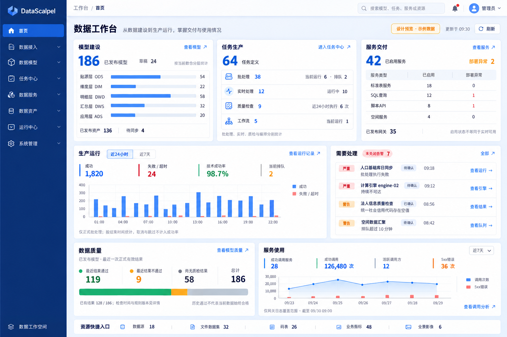
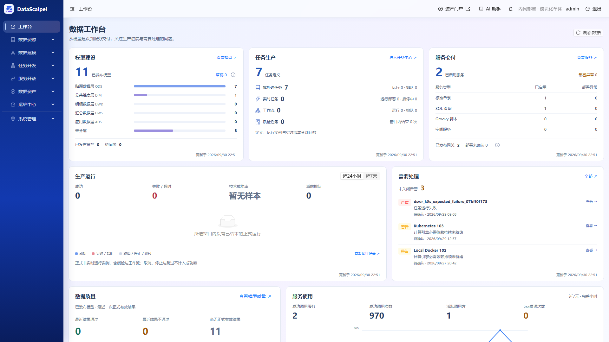
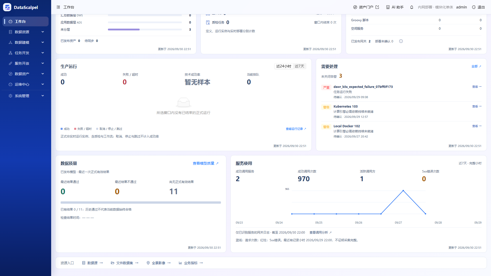

# 首页统计与工作台 V1 设计

状态：已实现，首页专项测试与开发环境验收通过。全量工程测试存在既有失败，详见 [测试记录](homepage-statistics-v1-verification.md)。本文维护实际指标口径、前后端代码归属和实现边界。

日期：2026-09-30。适用范围：DataScalpel 管理端首页 `/`，以及为首页补充的业务统计能力。

遵循 [根开发约定](../../AGENTS.md)、[前端约定](../../data-scalpel-ui/AGENTS.md)、[页面与交互规范](../development/frontend-ui.md)、[错误与 OpenAPI 契约](backend-api-response-and-error-handling.md)。

## 1. 目标与设计原则

首页面向项目管理员与数据开发人员，兼顾建设概览和日常处理，回答四个问题：

1. 已经形成了哪些模型、任务和服务能力？
2. 生产运行是否顺畅，哪些对象需要处理？
3. 哪些数据已经检查，哪些模型最近检查发现问题？
4. 已发布的服务能力有没有被实际调用？

每项指标必须具备明确的统计对象、状态、时间范围、数据来源和后续查看入口。类型划分用于理解能力构成和不同运行语义，不为每个枚举值增加独立大卡片。

不建设通用指标计算平台，不新增 Maven 模块、生产依赖、统计配置表、统计实体、全局状态框架或调度机制。沿用管理数据库和已有运行、网关小时汇总数据。

首页不展示未经定义的综合健康分、治理成熟度、全平台质量合格率、服务可用率和数据新鲜度达标率。模型、资产、服务存在关联，数量不相加为“数据资源总量”。累计处理行数不解释为新增业务数据量。

## 2. 效果图与页面组成



效果图中的数字、资源名称和时间都是示例，不进入生产代码。图中侧栏和顶栏是视觉示意；实现复用当前 `AppShell`、真实菜单、权限和用户信息，不按图片重写应用外壳。图表示例数值不作为统计验收依据，准确口径以本文为准。

```text
首页标题                                      更新时间 / 刷新

模型建设                  任务生产                  服务交付
发布数量、实际数仓分层      四类任务、各自运行状态      四种类型、部署与发布
资产发布与同步摘要

生产运行趋势（较宽）                         需要处理
近24小时 / 近7天、当前状态                   未关闭告警与处理入口

数据质量                                   服务使用
结果覆盖、最近有效结论                       近7天调用、活跃主体、趋势

资源快捷入口
```

当前界面采用湖蓝主题：顶部三列建设与交付概况，主面板下方以“服务调用 / 任务执行”切换两个完整分析视图，右侧为告警与质量。上图仅为历史布局参考，现行响应式布局见前端页面与交互规范。常规笔记本按工作区高度布局，告警列表可内部滚动；更小窗口自然重排。所有统计口径、权限与详情入口仍遵循下文，口径与刷新时间通过就近说明入口查看，不截断实际统计数据。

## 3. 指标口径

### 3.1 模型建设

来源：`DataModel`、`ModelWarehouseLayer`；资产摘要单独来源于 `Asset`。

| 展示项 | 口径 | 查看入口 |
| --- | --- | --- |
| 已发布模型 | 当前状态为 `PUBLISHED` 的模型数，按模型 ID 计数 | 已发布模型列表 |
| 草稿 | 当前草稿模型数，与已发布数量分开 | 草稿模型列表 |
| 分层数量 | 在已发布模型范围内，按实际 `warehouseLayerId` 分组 | 对应分层且已发布的模型列表 |
| 已发布资产 | `Asset.status=PUBLISHED` 的资产数；不与模型数相加 | 已发布资产列表 |
| 待同步资产 | 已发布资产中 `syncStatus=OUTDATED` 的数量 | 对应资产筛选 |

分层读取用户实际配置和排序，不写死 ODS/DIM/DWD/DWS/ADS。未分层单独展示；存在失效引用时保留“分层不可用”项，不能使分类合计小于总数。首页使用横向分类条形图，每页6项，超过后显示范围、总分类数及上一页/下一页；所有页面使用全部分类的统一最大值作为比例尺，不合并或丢弃零值分类。长名称通过悬浮或键盘聚焦显示完整文本，点击仍进入对应已发布模型列表。分类增删不增加图表高度，也不产生遮挡末行的内部滚动条。任务定义采用环形图表达各类型占比，图例保留零值类别、数量及运行摘要；没有任务时展示中性空环和“暂无任务”。已启用服务采用纵向柱状图，以统一数量轴比较各类型；柱内红色部分代表该类型已启用服务中的部署异常数量，零值不绘制虚假柱高。两类图表保持与模型图一致的固定高度，支持悬停/聚焦查看数值和按类型跳转列表。

`MANAGED` 平台建表、`EXTERNAL` 绑定已有表是另一维度，放在说明或展开内容，不与数仓分层混合相加。模型发布仅代表结构契约发布，不表示当前数据新鲜、质量合格或外部物理表持续可访问。

资产来源异常与待同步分开解释；来源缺失、不可用或检查失败不能统称“待同步”。同步状态依据最近一次检查或同步，不在首页打开时触发检查。

### 3.2 任务生产

任务定义数来自当前 `DataTask`，各状态均计入并明确标为“任务定义”；不是已投产任务数。类型沿用现有定义，不创建平行枚举体系。

| 首页分组 | 定义类型 | 配套运行信息 |
| --- | --- | --- |
| 批处理 | `LOCAL_SQL`、`SPARK_CANVAS`、`SPARK_JAR` | 当前正式运行实例数、排队实例数 |
| 实时处理 | `SPARK_STREAMING_CANVAS`、`SPARK_STREAMING_JAR` | 当前正式部署按运行状态统计，启动中、停止中与运行中区分 |
| 质量检查 | `SPARK_MODEL_QUALITY` | 最近24小时已结束的正式检查运行次数；技术失败与质量不通过分开 |
| 工作流 | `WORKFLOW` | 当前正式工作流运行实例数，进入已有工作流或运行页面 |

定义类型可在明细展开；首页四组与前端 `taskViews.ts` 一致。后端返回原始任务类型与计数，前端复用已有分组映射，不能单独维护另一套分类。

当前运行不受历史窗口限制，排队不是失败。活动实例按当前状态查询，`CANCEL_REQUESTED`、`STOP_REQUESTED` 单独解释，不能提前计为已结束。

实时运行量使用正式部署状态，不用“最近7天是否启动”判断活跃；按现有运行工作台的部署范围选择规则查询，避免旧版本部署混入当前量。标题注明部署单位，不把部署数与任务定义数直接作比率。

运行事实可能保留已删除任务的历史或活动实例，不能要求运行数一定小于当前定义数。工作流父运行与子任务各自是运行实例，不相加解释为业务处理次数。

### 3.3 服务交付

来源：`DataService`、`DataServiceDeployment`、`GatewayServiceBinding`。

| 展示项 | 口径 |
| --- | --- |
| 已启用服务 | 当前 `DataService.status=ENABLED` 的服务数 |
| 类型明细 | 标准表 `STANDARD_TABLE`、SQL查询 `SQL_QUERY`、脚本API `SCRIPT_API`、空间服务 `SPATIAL_SERVICE`，各行按同一启用范围计数 |
| 部署异常 | 已启用服务中，部署记录状态为 `FAILED` 的服务数；按服务 ID 去重 |
| 部署处理中或未确认 | `PENDING`、`REMOVING`、缺失部署记录等按真实状态说明，不混成已成功或已失败 |
| 已发布网关 | 当前存在 `publicationStatus=PUBLISHED` 绑定的服务数，按服务 ID 去重，不按绑定条数计数 |

网关发布量是独立交付状态，不保证是当前已启用服务的严格子集，也不凭它证明网关和上游实时可用。服务启用状态、部署状态、发布状态均沿用当前领域语义；首页不主动访问 Engine、GeoServer 或网关执行探测、对账、发布和重试。

### 3.4 生产运行趋势

复用 [运行工作台与告警 V1](global-runtime-workbench-and-alerts.md) 的概览查询，默认最近24小时，可切换最近7天。

- 历史统计仅包含 `executionMode=REAL` 的非实时运行，按 `endedAt` 落入 `[from,to)` 统计。
- 当前实现中的非实时范围包括普通批处理、质检和工作流。首页标注“非实时运行实例”，不把它解释为普通批处理任务数。
- 页面将技术成功率标注为“执行成功率”，口径仍为 `SUCCESS / (SUCCESS + FAILED + TIMED_OUT)`；取消、停止、跳过不进入分母。分母为零显示“—”，上下文帮助说明计算方式；空状态明确提示所选时间内没有完成的任务，避免将运行中或排队中误解成零任务。
- 趋势使用 UTC 小时/日边界。数据库按结束时间的 epoch 分桶，避免 PostgreSQL 会话时区与 Java `Instant` 截断边界不一致而丢失分日数量。如果趋势合计与完成汇总不一致，前端展示真实的完成结果分布和重新加载入口，不伪造时间分布或显示无数据。
- 质量不通过与执行失败是两个维度，不能将同一运行在成功与失败里重复计数。
- 当前排队和运行覆盖全部正式活动实例，与历史窗口明确分开，分类详见任务生产区。
- 趋势点击携带对应桶的 `[from,to)`、结束时间字段和非实时范围进入运行列表；指标与列表使用同一口径。
- 现有概览和成功率语义保持兼容；新增分类摘要采用附加字段，不静默替换原字段定义。

### 3.5 需要处理

复用告警中心，不新增首页待办状态。

- 展示当前用户有权查看的 `OPEN`、`ACKNOWLEDGED` 告警，总数与列表范围一致。
- 列表最多5条，优先严重，再优先待确认，同级按发生时间倒序；不足5条展示实际数量。
- 每条包含级别、对象、原因摘要、处理状态、发生时间和告警详情入口。
- 首选跳转现有告警详情，再通过其现有权限和状态判断进入运行、模型结果或引擎详情；对象已删除时保留告警证据。
- 后续运行成功不自动关闭历史失败告警。关闭、确认、静默继续使用告警中心现有流程。
- 资产同步问题、服务部署状态和网关请求错误不与告警相加生成一个“异常总数”。

### 3.6 数据质量

范围为当前已发布模型，统计单位为模型。每个模型只取一份最近正式有效检查结果，分为“最近结果通过”“最近结果不通过”“尚无正式有效结果”，三项合计等于范围内模型总数。

有效结果至少满足：`executionMode=REAL`、`status=SUCCESS`，且有质量结论、规则快照时间和结束时间。按结束时间选最近记录，同时间使用稳定次序消除歧义。技术执行失败不构成质量结论。

返回结果应保留检查时间范围。模型存在更晚的正式执行失败时另行标识，不能仅凭历史通过结果显示当前正常。当前规则与历史结果的适用性须依据现有可验证的版本或快照信息判断；没有足够证据时表达“历史检查结果”，不能臆测最新规则已覆盖，也不以此需求新增通用版本体系。

现有单模型 `ModelQualityOverviewService` 会读取结果制品，且最近结果查询没有显式的正式运行过滤。首页只读管理库摘要，禁止逐模型调用该详情服务。实现采用独立质量明细 Drawer，与首页共用同一管理库结果选择逻辑，明确显示正式结果、结束时间、规则快照和最近执行失败。Drawer 中的模型链接进入基本详情；既有单模型质量页及其默认历史/试运行展示行为保持不变。

“尚无正式有效结果”可能包含从未执行或只有技术失败的模型，不称为“从未检查”。不将模型结论聚合成全平台数据质量合格率。

质量数字必须能进入相同范围的模型明细。该条件是跨模型与运行的聚合条件，不扩展通用 Search DSL 的字段或语法；如现有模型列表无法表达，增加质量业务只读筛选入口或明细 Drawer，分页与条件查询仍复用现有基础设施。

### 3.7 服务使用

复用 [网关运维统计](gateway-operations-dashboard.md)。默认最近7天已完成小时，展示实际 `[from,to)` 和统计截止时间；HTTP 使用 UTC，页面转用户时区。

| 指标 | 口径 |
| --- | --- |
| 调用总量（主要指标） | 复用网关概览的 `requestCount`，同一已完成小时窗口内纳入统计的请求次数 |
| HTTP成功率（主要指标） | 2xx响应次数 / 请求总数，无请求时显示“—”，不等同业务结果正确 |
| 平均响应耗时（主要指标） | 网关概览的 `averageRequestLatencyMs`，单位ms；无延迟样本显示“—” |
| 服务端错误（主要指标） | 同一窗口的5xx响应次数 |
| 成功调用服务 | 窗口内至少有一次 HTTP 2xx 响应、并已解析出本系统服务 ID 的不同服务数量 |
| 成功调用次数 | 同一窗口已接收且纳入小时汇总的 HTTP 2xx 次数；不把3xx混为2xx |
| 活跃调用方 | 窗口内至少一次2xx响应、已识别 Consumer ID 的不同调用方数量；匿名和身份未解析请求不虚构主体 |
| 5xx错误 | 同一窗口的5xx响应次数，不与拒绝分类重复相加 |
| 调用趋势 | 小时桶按显示粒度合并，请求数与错误数求和；不从图表采样反算概览 |

主体统计反映窗口内可识别的历史使用，可能含目前已停用或删除的对象，不直接除以“当前已启用服务数”形成使用率。成功调用次数、活跃主体的覆盖范围和未解析身份差异须在说明中明确。

首页将调用总量、HTTP成功率、平均响应耗时、服务端错误置于图表上方；成功调用次数、调用服务数和调用方数作为底部辅助信息保留。图表每个时间段支持悬停、键盘聚焦和点击，显示准确的起止时间、请求次数及5xx次数。各概览、趋势与主体摘要的加载失败独立提示并可重试。

仅统计现有网关小时表覆盖的调用：必须已识别服务，且身份未冲突；成功次数包含匿名或未识别调用方，但不包含服务身份未解析的日志。直连 Engine、GeoServer 或其他未接入路径不计入；HTTP成功也不等同业务结果正确。

小时统计与最近15分钟原始日志摘要不相加。接收开关开启不是采集正常证明。未开启接收、查询失败、没有可确认的统计覆盖，与已知范围内零调用区分；无样本时不展示成功率100%。截止时间表示查询窗口，不宣称所有网关事件已完整到达。

复用 `GatewayAccessQueryService` 的时间窗口、保留期校验和小时汇总路径，补充主体去重查询；不能通过有限 Top N 排行计算活跃主体总数。仅访问 DataScalpel 自身已有日志/统计表，不读取独立网关 schema。

### 3.8 资源快捷入口

数据源、文件数据集、数据填报、业务指标、全景影像按各自现有资源列表提供入口，快捷栏独立横跨工作区底部。数量取各域现有分页查询的 `totalElements`，仅请求第一页一条记录；沿用各域权限，未授权时不请求，加载中显示省略号，失败显示破折号并保留列表入口。刷新首页时同步刷新这些数量。注册资源数量不代表可用、已发布或已被使用。权限不足的入口隐藏，不以0表示无权限；不为这些背景数量拉取全量实体或建立跨域统计框架。

服务调用与任务执行共享分析区，通过标签切换；活动面板和图表沿 Ant Design 6 的 body-holder、body、content 容器自适应剩余高度，避免内容下方固定留白。正常笔记本和桌面视口为快捷栏保留高度，告警列表局部滚动；过小视口允许内容自然展开，避免裁剪统计指标。

## 4. 后端代码结构

代码根目录为 `data-scalpel-business/src/main/java/cn/superhuang/data/scalpel/business`。统计归属于业务包，首页不新增集中所有领域 SQL 的 `DashboardService`。

以下为拟实施清单；“新增”文件尚未创建，“扩展”仅指增加本次必要能力。

```text
business/
├─ model/
│  ├─ web/resource/DataModelResource.java                 扩展统计入口
│  ├─ web/response/DataModelStatisticsResponse.java       新增
│  ├─ service/DataModelService.java                       扩展
│  └─ repository/DataModelRepository.java                 状态、分层聚合
├─ task/
│  ├─ web/resource/DataTaskResource.java                  扩展统计入口
│  ├─ web/response/DataTaskStatisticsResponse.java        新增
│  ├─ service/DataTaskService.java                        扩展
│  └─ repository/DataTaskRepository.java                  按定义类型计数
├─ operations/
│  ├─ web/resource/RuntimeWorkbenchResource.java          复用
│  ├─ web/resource/AlertIncidentResource.java             复用
│  ├─ web/response/RuntimeOverviewResponse.java           复用
│  ├─ web/response/RuntimeTaskMetrics.java                增加分类摘要
│  ├─ web/response/RuntimeTaskTypeMetrics.java            新增
│  ├─ service/RuntimeWorkbenchService.java                扩展分类运行聚合
│  └─ service/AlertIncidentService.java                   复用
├─ service/
│  ├─ web/resource/DataServiceResource.java               扩展统计入口
│  ├─ web/response/DataServiceStatisticsResponse.java    新增
│  ├─ DataServiceManagementService.java                   扩展，保留现有位置
│  ├─ repository/DataServiceRepository.java               类型、状态聚合
│  ├─ repository/DataServiceDeploymentRepository.java    部署状态聚合
│  ├─ gateway/repository/GatewayServiceBindingRepository.java
│  │                                                     已发布服务去重
│  └─ accesslog/
│     ├─ web/resource/GatewayAccessStatisticsResource.java 扩展
│     ├─ web/response/GatewayAccessUsageResponse.java      新增
│     └─ service/GatewayAccessQueryService.java            扩展主体聚合
├─ quality/
│  ├─ web/resource/ModelQualityStatisticsResource.java   新增
│  ├─ web/response/ModelQualityStatisticsResponse.java   新增
│  ├─ service/ModelQualityOverviewService.java            现有单模型详情
│  └─ service/ModelQualityStatisticsService.java          新增跨模型汇总
└─ asset/
   ├─ web/resource/AssetResource.java                     扩展管理端统计
   ├─ web/response/AssetStatisticsResponse.java           新增
   ├─ service/AssetManagementService.java                 扩展
   └─ repository/AssetRepository.java                     发布、同步聚合
```

职责约定：

- Resource 只负责路由、参数绑定、Validation、权限和 OpenAPI，不执行 JPA 查询或业务统计。
- Service 决定范围、状态语义并组装响应；简单统计在现有 Service 补方法，不机械增加一套类。质量统计因独立的跨模型结果选择规则，使用专用 Service。
- Repository 在数据库端执行 count、group by、去重和必要投影。质量统计按实际需要扩展 `DataModelRepository`、`TaskRunRepository`；运行继续复用现有工作台查询路径，不为本次首页重构整个运行模块。
- 网关统计沿用已有 `NamedParameterJdbcTemplate` 查询，不额外包装一套无意义 Repository 或替换其技术方案。
- 新 Response 为 Business 管理端契约，不进入 Contracts；不暴露 Entity，不在 Resource 中定义请求/响应内部类。
- 小型统计分项可作为对应 Response 的命名嵌套 record；对外字段和枚举仍须完整中文说明。
- 不改变 Admin 启动、SDK、Canvas、Runner、Dispatcher 或独立 Super API Gateway 的执行/发布协议。

## 5. API 规划与响应内容

所有新增接口只读使用 GET，沿用现有业务权限；成功直接返回 Response，失败使用统一 ProblemDetail。不增加首页专属权限体系或 `Result<T>` 包裹。

| 接口 | 方式 | 权限/范围 | 主要返回内容 |
| --- | --- | --- | --- |
| `/api/v1/models/statistics` | 新增 | `model.view` | 采集时间、发布/草稿数量、实际分层ID/名称/数量、管理方式数量 |
| `/api/v1/tasks/statistics` | 新增 | `task.view` | 采集时间、定义总数、按原始TaskType分组的定义数 |
| `/api/v1/operations/overview` | 扩展已有GET | 复用各来源权限 | 原有时间窗、运行趋势、告警总数；增加类型运行摘要与正式部署状态数量 |
| `/api/v1/alert-incidents` | 复用已有GET | 复用告警来源权限 | 未关闭告警的分页摘要及详情跳转ID |
| `/api/v1/data-services/statistics` | 新增 | `service.view` | 采集时间、启用总数、各类型数量/部署状态、已发布网关服务去重数 |
| `/api/v1/model-quality/statistics` | 新增 | `model.view`，与既有模型质量概览一致 | 采集时间、已发布模型总数、通过/不通过/无有效结果数量、最近执行失败等辅助状态 |
| `/api/v1/gateway-access-statistics/usage` | 新增 | `service.view` | 实际完整小时窗口、采集时间、接收开关、成功调用次数、活跃服务/调用方、5xx数量 |
| `/api/v1/gateway-access-statistics/hourly` | 复用已有GET | `service.view` | 同范围调用趋势；复用已有完整小时语义 |
| `/api/v1/assets/statistics` | 新增 | `asset.view` | 采集时间、已发布资产数、在已发布范围内的同步状态分类 |

`models`、`tasks`、`data-services` 的集合地址已经按当前 Resource 核对。新增静态 `/statistics` 路由须与现有 `/{id}` 和其他静态路由一并核对。

模型、任务定义、服务交付、资产是当前量，不接收历史时间参数。运行区沿用 `from/to`；网关使用区接受 `from/to`，首页明确传入近7天完整小时窗口，服务端沿用保留期校验并返回实际窗口。查询失败不能返回全零 DTO。

同一个响应内的总数与分项尽量由单个聚合查询或一致的只读快照产生，避免并发变更造成分类合计漂移。页面不同区域允许有不同采集时间，不宣称全页是原子快照。

所有 Response 的采集时间、范围边界、单位、nullable 条件、未知/未接入含义、分类范围和去重规则须写入中文 `@Schema`；Resource 的行为、参数、权限失败及只读语义写入 `@Operation`/`@Parameter`。不以图片文案替代 API 契约。

## 6. 前端代码结构与交互

沿用单一 React 应用，`app → modules → shared`；首页继续由现有 `/` 懒加载路由装配。

```text
modules/dashboard/
├─ pages/
│  ├─ DashboardPage.tsx            组合、布局、时间选择与整体刷新
│  └─ dashboard.css               仅首页作用域样式
├─ components/
│  ├─ ModelOverview.tsx            模型与资产摘要
│  ├─ TaskOverview.tsx             定义分类与运行摘要
│  ├─ ServiceOverview.tsx          服务交付
│  ├─ RuntimeOverview.tsx          非实时运行趋势
│  ├─ AttentionList.tsx            告警摘要
│  ├─ QualityOverview.tsx          跨模型质量摘要
│  └─ ServiceUsage.tsx             网关使用情况
└─ hooks/
   └─ useDashboardQueries.ts       查询组合、权限启用与刷新
```

业务 API、Hook、响应类型跟随各自 `model/task/operations/dataservice/asset` 模块，通过 `index.ts` 导出必要入口；首页不穿透跨模块内部路径。质量前端继续跟随现有模型模块，无需为后端包名新增前端模块。查询缓存继续由 TanStack Query 管理，不维护第二份长期数据状态。

任务分类直接复用 `taskViews.ts` 的 `/task/batch`、`/task/streaming`、`/task/workflows`、`/task/quality`。运行、告警复用既有 URL 筛选与详情入口。模型分层、服务类型、资产同步状态和质量筛选须补齐目标页面的参数解析与实际查询，不能只有链接外观却跳入全量列表。

筛选跳转须同时传递统计范围、状态及必要时间字段，进入目标页后明确显示已应用条件。枚举和ID做正常校验；既有手动筛选、查询按钮、分页和详情行为保持兼容。

视觉使用现有 Ant Design、图标、格式化函数、`ContextHelp`/`InlineFeedback` 等组件；图表使用项目已有能力，不新增依赖。共享组件只有在至少两个真实区域需要且语义一致时再抽取，不预建通用统计卡片框架。

旧首页样式位于 `styles/global.css`，本次新样式集中在首页目录。仅删除确认不再引用的旧首页规则，不顺带重构全局主题或应用外壳。

## 7. 权限、刷新、性能与异常状态

- 前端依据现有权限启用对应查询并展示区域；后端仍独立校验权限。无权限隐藏，不能显示0，也不能通过总数推断被隐藏来源。
- 模型与资产在同一视觉区域但保持独立请求和权限；资产请求失败不影响模型统计。
- 建设数量、质量摘要建议每60秒刷新；运行概览沿用30秒；告警沿用10秒；网关小时统计沿用5分钟。标签页在后台暂停轮询，保留手动刷新。
- 全页刷新并行触发已启用查询；单区失败显示局部错误和重试，其余已成功区域保持可用。旧数据可保留，但同时显示刷新失败和最后成功时间。
- 已知为空、加载中、无权限、未接入、查询失败、历史样本存在但当前观测不可用分别表达，不统一降级为0或正常。
- 时间窗按查询刷新推进；query key 包含实际范围和所有影响响应的筛选项，概览与趋势使用同一窗口。
- 首页不扫描外部物理表、不触发全表count、不访问外部引擎探测、不下载质检结果制品。统计查询仅使用控制面必要字段和已有小时表。
- 不逐对象调用详情服务、不拉取全部定义JSON/脚本/Canvas、不为计数加载全量实体。资产门户中领域树和热门标签计算不搬入首页统计。
- 不预设缓存、物化视图或新定时汇总表；出现真实查询瓶颈后，结合查询计划和现有索引优化，新增机制按工程约定单独确认。

## 8. 实施顺序与完成条件

1. 在现有业务包补齐统计查询、DTO和中文OpenAPI，先固定总量、分项和时间语义。
2. 在前端业务模块增加API/Hook公开出口，保持与专题页查询、权限一致。
3. 实现首页布局和各业务区，接真实数据，补加载、空态、错误、无权限和未接入状态。
4. 补齐分类数字、图表时间桶、告警和质量摘要的真实下钻路径。
5. 更新本文实施状态及有关专题的接口/口径说明，不将本设计误标为已验证功能。

完成时应满足以下业务条件；这些条件不恢复强制测试要求，验证政策仍由根约定统一控制：

- 模型分层、任务类型、服务类型使用实际数据与稳定类型定义，无效果图示例残留。
- 模型分类合计与同范围总数一致；服务与网关绑定正确去重；运行次数不冒充任务数量。
- 正式/试运行、实时/非实时、技术失败/质量不通过、启用/部署/发布状态区分准确。
- 无样本、未接入、无权限和失败不伪造零值或正常状态。
- 点击后进入与指标相同范围的真实记录，跨模型质量条件不扩展Search DSL。
- 部分区域错误不拖垮整个首页，后台页签不持续轮询，首页不会发起外部系统扫描。
- 新接口具备完整中文契约，实际运行时OpenAPI的字段描述完整性遵循工程规范。

本次已按用户明确要求完成业务实现和专项验证，复用用户前端 `localhost:8887`，通过根目录 `start-local-dev.sh --admin-only --threads 2` 启动后端 `localhost:8080`。未改变数据库、Schema 或外部服务地址，未新建独立环境。

## 9. 实际界面与交付文件

首页保持原有 AppShell，支持纵向滚动，窄屏自动单列；数据来自用户开发环境，截图并非示例数据。





- 后端：各域统计方法与响应 DTO；质量业务新增统计 Repository、Service、Resource。
- 前端：首页组件位于 data-scalpel-ui/src/modules/dashboard，各域 API 和 Hook 通过公开入口导出。
- 测试：HomepageStatisticsIntegrationTests、dashboard 的专项 Vitest、dataModelListRoute 测试、e2e/homepage.spec.ts。
- Playwright 仅连接已启动的开发环境；可通过 DATASCALPEL_TEST_BASE_URL 指定现有地址，不再自动另起 Vite。

