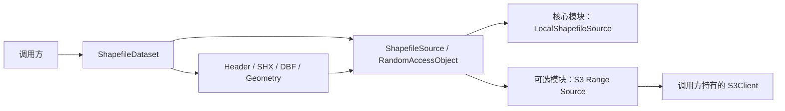

# Shapefile Reader 本地与 S3 双来源设计

## 1. 定位与状态

`data-scalpel-shapefile` 的 SHP、SHX、DBF、CPG 和 PRJ 解析现统一建立在随机访问 Source 之上。本地 Path 是核心模块自带实现，`data-scalpel-shapefile-s3` 是可选的同步 AWS SDK v2 Range 适配器。

两个模块均已实现并通过确定性测试。它们仍是独立解析组件，不接入 Business、Admin、文件数据集、对象存储业务配置、异步解析队列、REST API 或前端。具备 S3 Source 不代表平台已经可以上传或解析 SHP 文件数据集。

## 2. 模块边界



- `data-scalpel-shapefile`：纯 JDK 核心、Source SPI、本地来源和全部格式解析，运行时第三方依赖为零。
- `data-scalpel-shapefile-s3`：依赖核心与 AWS SDK v2 S3；排除 CRT 和 Netty 异步客户端。
- AWS Endpoint、Region、凭证、代理、超时和 SDK 重试由调用方配置。
- Dataset 取得 Source 所有权，但不取得调用方 `S3Client` 的所有权。
- 适配器不调用 `ListObjects`。AWS S3 在缺少 `s3:ListBucket` 权限时可能将不存在对象的 HeadObject 表达为 403；可选组件只有明确的 404/`NoSuchKey` 才按不存在处理，不需要探测时应由调用方将对应 Key 配置为 `null`。

ZIP、ListObjects 图层发现、上传、删除、完整对象下载、临时文件、磁盘缓存、异步 SDK、后台预取和并发请求均不在本设计范围。

## 3. 核心 Source 契约

`ShapefileComponent` 固定定义 `SHP/SHX/DBF/CPG/PRJ`。前三个必需，后两个可选。

`ShapefileSource` 提供：

- 安全的 `ShapefileSourceInfo`；
- 按固定组件角色检查存在性；
- 打开位置无关的 `ShapefileRandomAccessObject`；
- 幂等关闭来源及其创建的所有对象。

`ShapefileRandomAccessObject.read(position, target)` 不共享可变游标。核心 `RandomAccessObjectReader` 统一执行边界检查、循环读满、零进展检测、短读分类与 checked arithmetic。

`ShapefileDataset.open(Path, options)` 先创建 `LocalShapefileSource`，再进入与远程来源相同的解析路径。`open(source, options)` 调用后 Dataset 取得 Source 所有权；打开失败也会关闭来源并保留 suppressed 关闭异常。CPG 和 PRJ 通过相同 SPI 受限读取，不存在本地 Path 旁路。

## 4. S3 组件位置

默认入口由一个 `.shp` Key 派生小写伴随扩展：

```text
s3://bucket/layers/roads.shp
s3://bucket/layers/roads.shx
s3://bucket/layers/roads.dbf
s3://bucket/layers/roads.cpg
s3://bucket/layers/roads.prj
```

S3 Key 区分大小写且适配器不调用 `ListObjects`。若实际对象为 `roads.SHX` 等名称，调用方必须通过 `withComponentKey` 显式覆盖。可选组件也可设置为 `null`，表示不探测该 Key。所有组件必须位于同一 bucket，非空组件 Key 必须互不重复。

显式 Key 不按本地路径解释，不要求位于同一前缀；调用方负责它们属于同一个逻辑图层。

## 5. 打开快照与多对象一致性

S3 Source 创建时先完成全部配置组件的 HeadObject，之后才允许 Dataset 读取：

- SHP、SHX、DBF 缺失返回 `MISSING_COMPONENT`；
- CPG、PRJ 只有明确的 404/`NoSuchKey` 才视为不存在；
- 保存每个存在对象的 Content-Length、VersionId 和 ETag；
- VersionId 与 ETag 均缺失时返回 `INVALID_SOURCE`；
- Dataset 在任何数据 GET 之前使用 `ShapefileReadLimits` 校验组件大小。

对象有 VersionId 时，后续 Range GET 固定该版本；没有 VersionId 时使用冻结的 ETag 与 `If-Match`。成功响应仍严格复核 Content-Length、Content-Range、VersionId 和 ETag。

VersionId/ETag 只能保证单个对象从 Head 后保持不变，不能为五个独立对象提供原子快照。发布方应使用不可变前缀，或由未来上传流程维护包含全部对象版本标识的 manifest。manifest 不属于 Reader 第一版。

任一 Range 返回 412/416、不同版本、不同 ETag 或不同对象总长度时，Source 锁存 `SOURCE_CHANGED`；同一 Dataset 的所有后续组件访问都稳定失败，避免继续返回混合版本结果。

## 6. Range 与共享缓存

每个缓存未命中只发起一个闭区间请求：

```text
Range: bytes=start-end
```

默认块大小 1 MiB，可配置为 64 KiB～8 MiB 的 2 次幂。每个 Source 维护一个跨 SHP、SHX、DBF、CPG、PRJ 共享的访问顺序 LRU，默认总上限 64 MiB。缓存 Key 包含对象 Key、VersionId/ETag token 和 block index。

- 块内重复读取直接命中内存；
- 跨块读取按块拆分；
- 最后一块按冻结对象长度截断；
- 淘汰按实际 byte 数计算，缓存总量不超过上限；
- 短响应、无效元数据和失败响应不进入缓存；
- Source 关闭时同步清空缓存。

该缓存吸收 SHX 8 字节索引项、SHP 记录头和 DBF 槽位的密集小读取。测试验证远程 GET 数量由实际触及的唯一块和 LRU 再读取决定，而不是由解析器的单次 Java 读取次数决定。

## 7. 错误映射与诊断

| S3 或响应情况 | `ShapefileErrorCode` |
| --- | --- |
| 初始 Head 的必需组件 404、`NoSuchKey` | `MISSING_COMPONENT` |
| 403、`AccessDenied` | `INVALID_SOURCE` |
| 快照后的 404、412、416、版本/ETag/总长度变化 | `SOURCE_CHANGED` |
| 响应体或 Content-Length 短于请求 | `TRUNCATED_INPUT` |
| 无效 Content-Range、意外响应元数据 | `IO_ERROR` |
| 超时、连接失败、S3 5xx | `IO_ERROR` |
| 组件超过核心读取上限 | `LIMIT_EXCEEDED` |
| 已关闭来源或对象 | `CLOSED` |

异常消息只包含组件角色和安全的 bucket/Key 位置。AWS SDK 异常作为 cause 保留，但凭证、Authorization Header、签名 URL和响应正文不会进入公开消息。

## 8. 生命周期与线程语义

- Dataset 正常或失败打开后均负责关闭 Source。
- Source 与随机访问对象关闭幂等。
- Dataset 关闭顺序是 Cursor、DBF、SHX、SHP、Source。
- S3 Source 关闭缓存和快照，但绝不调用 `S3Client.close()`。
- Dataset、Cursor 和 Source 不承诺线程安全；多个独立实例可读取同一不可变对象集合。

## 9. 验证结论

- 核心确定性夹具通过本地 Path 与内存 Source 逐值回归；
- Point、MultiPoint、Polyline、Polygon 的 Z/M 夹具通过本地与 S3 Source 逐 Schema、属性、坐标和记录号比较；
- 删除记录、Null Shape、中文 CPG 与原始 PRJ 在 S3 路径保持一致；
- 可控 Object Access 覆盖块边界、最后短块、LRU、跨组件缓存、失败不入缓存和 Source 失败锁存；
- 请求捕获测试验证 VersionId 与 If-Match；
- JDK 本地 HTTP 端点配合真实同步 `S3Client` 验证全流程只使用 HeadObject 与带条件的 Range GET；
- 默认跳过的真实 AWS S3/MinIO 测试只读已有夹具，不创建或删除对象；
- 架构门禁确认核心无 AWS 类，S3 模块无 CRT、Netty 异步客户端、JNI/JNA。

详细用法与远程测试参数见 [`data-scalpel-shapefile-s3/README.md`](../../data-scalpel-shapefile-s3/README.md)，格式兼容覆盖见[兼容性矩阵](../../data-scalpel-shapefile/docs/compatibility-matrix.md)。
