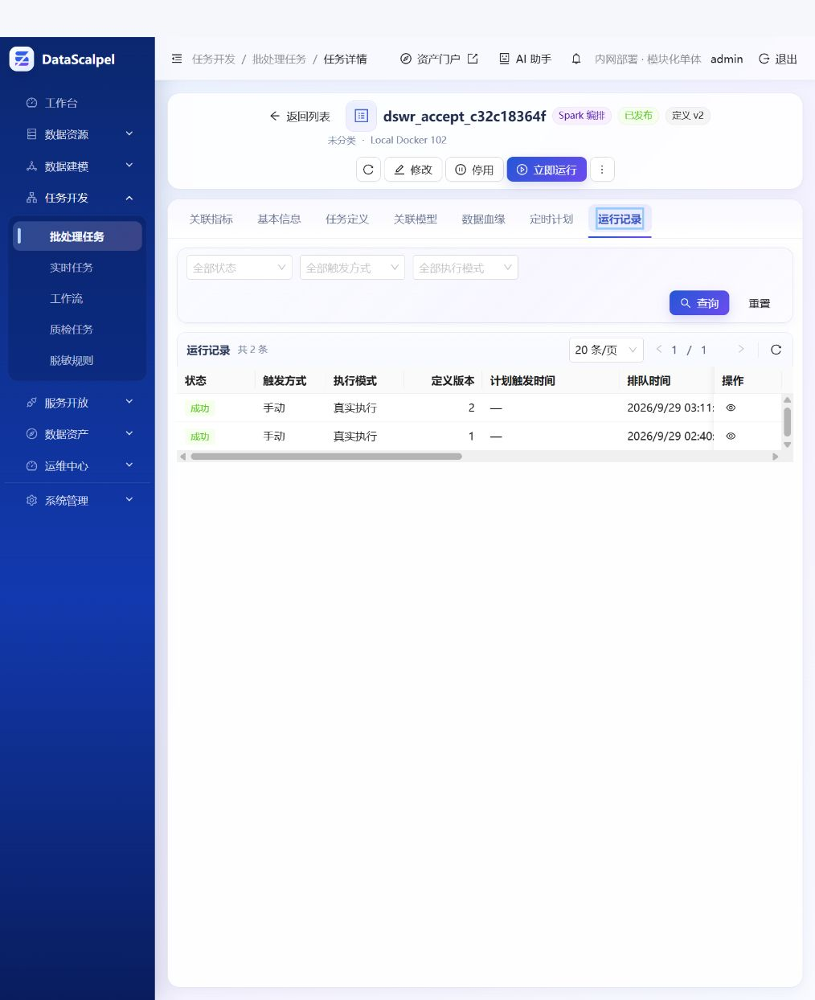
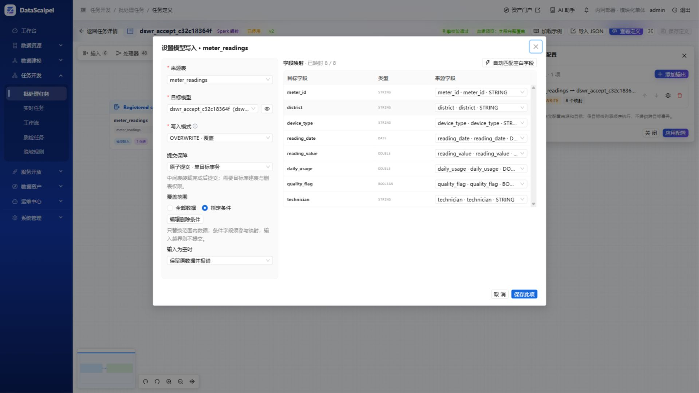

# 批处理写入改造验证报告（2026-09-29）

配套[最终方案](../design/batch-jdbc-write-implementation-20260929.md)。这是实际执行记录，不是待办清单；没有执行的项目不计为通过。

## 1. 交付与修改边界

- Canvas `MODEL_OUTPUT` / `JDBC_OUTPUT` 和公开 SDK 的模型/JDBC 批写接入同一个 `BatchJdbcWriter`。
- 新增可选 `batchWrite`；缺省/null 保持原有 DIRECT，不自动改变历史任务、权限需求和空输入行为。
- 原子 APPEND、OVERWRITE、UPSERT：分区装载中间表 → 校验 → 单目标数据库事务 → 清理。分区仍分批装载，最终目标不是每 500 行提交。
- OVERWRITE 支持全部/目标字段条件覆盖、范围越界与 SQL UNKNOWN 拒绝、默认空输入保护。页面提供条件组编辑及危险范围扩大/允许清空的二次确认。
- Canvas 协议升为 4.78；Business 保存升级、UI 导入、GraphPlan 门槛同步。条件覆盖血缘使用 `CONDITIONAL_OVERWRITE`，Admin 启动兼容既有 PostgreSQL 枚举检查约束。
- 不修改空间 Processor 算法、Sedona Geometry/WKB、EPSG、XY、NULL 原则；SDK 模型空间读写复用现有空间路径。自由 JDBC 写 Geometry 必须显式指定 EPSG，普通自由 JDBC 读取不会自动推断 Geometry。
- 不新增模块、运行时框架、全局锁或跨库事务；不修改 Dispatcher Topic、目标 Key、引擎配置或任务资源分配。
- SQL 原有写入和流式 Sink 不迁移为此批处理方案；原子选项用于批处理。旧 DIRECT 仍可能部分成功。

## 2. 数据库真实验证

在用户授权的 192.168.5.102 现有容器中执行。PostgreSQL/MySQL 原先运行；启动 Oracle、SQL Server、openGauss、ClickHouse。没有升级 OS、重建用户数据库或修改全局隔离参数。

| 数据库 | 实测版本 | 新原子写入结论 |
| --- | --- | --- |
| PostgreSQL / PostGIS | PostgreSQL 16.4，PostGIS 3.4 镜像 | 标量及空间测试通过 |
| MySQL | 8.4.11，InnoDB | 标量及空间测试通过；非 InnoDB 拒绝 |
| Oracle | Free 23ai 23.7 | 标量测试通过；不据此开放 Oracle Geometry |
| SQL Server | 2019 CU32 GDR | 标量测试通过；普通读取可能等待事务锁 |
| openGauss | 7.0 RC3 | 标量测试通过；没有空间扩展实测 |
| ClickHouse | 25.8.33 | 本轮不开放事务批写；EXCHANGE 在 102 内核 3.10 实际失败 |
| 瀚高、金仓、达梦等 | 本轮没有可运行实例 | 新原子能力不开放，不以兼容语法替代实测；原有 DIRECT 保留 |
| TDengine | 未启动 | 不扩大现有 SOURCE 边界 |

`BatchJdbcWriterIntegrationTest` 的 5 个数据库用例，每个内含 APPEND、条件覆盖、保留范围外行、NULL 越界拒绝、空输入拒绝、UPSERT 更新+新增、重复 Key 拒绝、目标主键冲突后整笔回滚、显式空输入清空、Spark 分区失败后重试。

分区重试实测：第一次尝试已向中间表提交 500 行，在第 550 行故障；Spark 重试完成，目标最终恰好 1,200 行。不是依靠关闭推测执行或事后按业务字段去重。持续装载失败时旧目标保留。

PostgreSQL 额外实测：合法 APPEND 重复行保留；identity 自增继续前进；默认值、索引、既有视图仍有效。删除后、提交前注入取消标记，目标回滚；真实 commit 后模拟丢失响应，返回 `BATCH_WRITE_COMMIT_UNKNOWN`、非自动重试且保留证据；提交后模拟清理失败仍返回成功。

最后一轮五库回归再次通过（37.07 秒）。新增 PostgreSQL 引用外键保护实测：目标被 ON DELETE CASCADE 引用时，原子 OVERWRITE 在任何目标 DML 之前拒绝，父表和子表各一行保持；同一结构 APPEND 仍成功，子表不变。SET NULL/SET DEFAULT/未知删除规则走相同拒绝逻辑，未逐规则做全厂商实测。

这不等于已经验证“数据库执行中的任何时刻都可立即取消”：测试覆盖提交前取消，不承诺驱动阻塞 SQL 的即时中断。连接失联/进程被强杀可能留下本轮中间对象，不扫描前缀自动删表。

## 3. 空间与已有行为回归

- PostgreSQL、MySQL：真实 Geometry 列写入 `POINT (30 40)` 与 NULL；检查 `ST_SRID=4326`、`ST_X=30`、`ST_Y=40`；APPEND、UPSERT、OVERWRITE 和原有共享 DIRECT 写入均通过。
- SDK 模型实际从上述空间表读取后，惰性 Dataset 再原子覆盖同一表；两库均通过，证明装载发生在删除之前，坐标/EPSG/NULL 未改变。
- 既有 Engine 定向 85 项测试通过：字段映射、Canvas 覆盖支持、执行摘要、执行器、失败分类、SDK 血缘、写入指标、Spatial JDBC。
- 新 SDK 条件转换 2 项测试通过：有限 Float/Double 保留；NaN/Infinity 在写入前拒绝。
- TestKit 9 项通过；真实已登记源数据 SDK DIRECT 回归与 Trial 不写正式表通过。
- 不是所有 Geometry 家族、维度、CRS、所有厂家特殊类型的完整矩阵验收。未对空间算法做整体改写，也未冒充完成原有空间路线图中尚未验收的能力。

## 4. 大表性能：公开测量口径

数据为独立构造的 1,000,000 行，字段为整数主键、分组、约 128 字符载荷。不得称为百万行正式业务数据。

| Spark 真实写入（秒） | PostgreSQL | MySQL |
| --- | ---: | ---: |
| DIRECT APPEND，空目标 | 8.999 | 4.884 |
| 原子 OVERWRITE，已有百万行目标 | 8.649 | 19.203 |
| 原子 UPSERT，匹配已有百万行 | 15.956 | 20.885 |

以上是最后一版代码（包括引用外键保护）再次执行的结果，两个数据库都完成百万行最终行数校验。首轮对应 PG 为 5.280 / 7.198 / 12.539 秒，MySQL 为 5.082 / 19.938 / 19.940 秒，保留两轮差异，不只选择最好数字。

4 个装载分区；使用真实 JDBC 和最终数据库事务。这三个场景操作不同，不把时间比值当成严格同条件开销倍数，也不能从第二轮 PG 数字得出“原子覆盖比追加快”的结论。测试不是跨机器、冷热缓存、并发负载的生产容量承诺。

数据库内部 SQL 独立实验：PG 装载中间表 2.014 秒、DELETE+INSERT+COMMIT 4.413 秒；MySQL 分别 8.003、9.427 秒。PG 1% 条件覆盖（无分组索引）0.948 秒。数字含 SSH/CLI 往返。两库删除尚未提交时，另一连接仍读取旧百万行，随后回滚保留数据。

**结论：中间表与事务存在真实的双写、日志和索引成本，MySQL 百万行全覆盖尤为明显。它解决提交完整性，不是免费提速。** 条件覆盖优先减少修改范围；目标条件索引、表规模、日志容量与并发读写需要按项目实际评估，不编造自动切换阈值。

PG 影子表加载含主键 2.186 秒，事务改名 0.189 秒，但已有视图仍指向旧表对象。ClickHouse 原生交换受宿主内核限制真实失败。因此本轮没有放出通用“影子表改名”按钮，避免换来更快但服务依赖错误的结果。

## 5. 现有业务数据与正式链路

只读使用已登记的 `meter_readings`，当前实际 **1 行**；其余已检查空间业务表为空，不能声称有大规模正式空间数据验收。

1. `RegisteredDataWriteIntegrationTest`：真实 Canvas REAL 执行及真实 `SparkJarJobContextImpl` 模型读写；专属随机目标；双向 `EXCEPT ALL` 核对全部字段与重复次数；源数据未改动。SDK DIRECT、Trial 不修改目标同时验证。
2. 使用现有本地开发环境的 Admin/Task Engine/前端，通过正常 API 创建并发布专属目标模型与 Canvas 任务，再经 Kafka → 102 Dispatcher → Local Docker Runner 正式执行。

验收对象保留供用户检查（没有定时计划）：

- 任务 `dswr_accept_c32c18364f`：`70f17f8f-8e86-409a-aa0a-3fd48eb9ceaa`。
- 专属目标模型：`f1bf1717-f7ee-403a-8ed7-49d632f81106`，物理表 `public.dswr_accept_c32c18364f`。
- 首次正式运行：`d1c3c866-908d-476e-9d70-d7e52cbbb94f`，状态 `SUCCESS`，`executionMode=REAL`。
- Runner 7,656 ms，输出节点 1,998 ms，写入指标 1；独立数据库验证源 1 行、目标 1 行、双向差异 0 行。结果制品、节点状态和 Admin 终态均已查询。
- 最终 r3 发布包复跑页面保存的 v2：运行 `d2bea4cc-f275-4a90-8b25-5e7550a64d24`，`REAL / SUCCESS`，Runner 9,297 ms，写入指标 1；日志包含 `BATCH_WRITE_COMMITTED`。再次独立核对源 1、目标 1、双向差异 0，确认已有目标重复覆盖不会增加数据。



指标定义是**提交成功所处理的输入行数**，不是目标净增长，也不虚构 UPSERT 插入/更新拆分；上述覆盖后目标仍为 1 行但处理行数为 1。

### 5.1 103 恢复后的 Kubernetes 补充验收

2026-09-29 上午，用户启动 103 后补齐。节点 `k8s103` 为 Ready（Kubernetes 1.32.13），KubeSphere 三个核心组件 Running。通过现有 Admin → Kafka → 102 Dispatcher → 103 Driver/Executor → 102 PostgreSQL 的正式链路执行，没有另起应用环境。

- 专属目标模型 `b4ef9349-026a-4ace-8d27-3703f02b7a5c`，物理表 `public.dswr_k8s_07bff0f173`；只读使用原 `meter_readings` 的实际 1 行。
- Canvas 任务 `ebf187b3-edd3-4553-9ab6-e427ac27afb0`：条件原子覆盖。
- 在线 Java/SDK 任务 `cbb5816e-c584-4df6-90f6-3047326ff65c`：正常在线编译后发布；`read("source").repartition(4)`，通过 `models().write(...).mode(OVERWRITE).mapSameName().batchWrite(BatchWriteOptions.atomic())` 写入专属目标。
- 故障任务 `24e875f0-8d4b-41a7-9d2a-e8caa6754e20`：输入 `rows.union(rows).repartition(4)`，制造最终 INSERT 唯一约束冲突；验收结束后已停用，无定时计划。

| 正式运行 ID | 场景 | 结果 / Runner 耗时 | 独立数据库核对：源 / 目标 / 双向差异 |
| --- | --- | --- | --- |
| `a6b11692-dae0-4578-b1b4-8903ed0ce840` | Canvas 条件覆盖，校时后原 Outbox 自动重试 | SUCCESS / 19,188 ms | 1 / 1 / 0 |
| `c97629dd-b195-44f2-bbec-7fa2b3f3a2b2` | Canvas 再次覆盖已有数据 | SUCCESS / 13,922 ms | 1 / 1 / 0 |
| `31721187-3006-4457-b075-ce2d10bea670` | 在线编译 SDK，4 分区原子覆盖 | SUCCESS / 74,089 ms | 1 / 1 / 0 |
| `1c11c9a9-f82f-4be1-ba30-d4f3e2e6f9bd` | SDK 再次覆盖 | SUCCESS / 15,297 ms | 1 / 1 / 0 |
| `5df0ea2e-9668-405e-a642-295e003c7fa4` | DELETE 后 INSERT 唯一约束冲突 | **预期 FAILED** / 13,333 ms；提交行数 0 | **1 / 1 / 0，原数据回滚保留** |

成功运行的日志均包含 `BATCH_WRITE_COMMITTED`，SDK 日志还包含专属验收标记；结果制品与日志接口正常。失败运行返回 `JDBC_CONSTRAINT_VIOLATION`、SQLState `23505`、`retryable=false`，没有提交成功标记。不是通过捕获异常后伪装任务成功。

如实保留测试过程中的两项修正：

1. 初版验收脚本误用 Admin 运行 ID 过滤 Pod；实际应按运行响应的 `externalExecutionId` 对应 Pod 的 execution-id 标签关联。首次运行的业务与数据检查成功，但脚本因缺少 Pod 捕获断言失败；修正后再次完整执行，并采集 Driver 与两个 Executor 的实际 imageID。
2. 最初的故障运行 `f019adbb-11a9-4393-9fda-c0d88b6871b8` 实际 SUCCESS、写入 2 行，因为专属目标没有唯一约束，重复数据本身合法，**不计为回滚通过**。通过正常 SDK 原子覆盖恢复专属目标为 1 行，再仅在该专属表添加 `dswr_k8s_accept_meter_unique UNIQUE(meter_id)`，才完成上表中的真实冲突回滚；没有给原业务表添加约束或修改数据。

本次 K8s 验证范围为上述 PostgreSQL 正式链路；百万行性能、五库矩阵和 Geometry 专项仍以本报告前面的实际测试为准，不声称在 K8s 重复完成全部组合。

## 6. 页面、协议与构建

- 1920×1080 实际页面检查：条件回读、目标字段编辑、全表覆盖风险确认、空输入清空确认、取消保留原设置。单个 API 条件打开编辑器时包装为等价 AND 组，允许继续添加条件/分组。
- 页面保存后通过 API 回读等价 AND 条件树与 `allowEmptyOverwrite=false`；由条件原子覆盖切为 DIRECT 同样出现全表覆盖确认，取消不改变设置。


- UI 定向 50 项测试通过（定义 JSON 47 + 新写入配置 3）；TypeScript 构建检查及修改文件 ESLint 通过。
- Admin 主代码、Dispatcher、Engine 完整打包通过；运行时 OpenAPI 的 `BatchWriteOptions` 字段中文说明已检查。
- 曾发现“打包成功但 Boot 嵌入旧 Contracts”的增量制品问题，部署前新增 ZIP 内容检查和 SHA-256 核对；Dispatcher 强制重建 JAR。Engine 使用 `task-engine-full-package`，避免默认跳过 cluster 制品。
- Business/Admin 全部历史测试未通过：现有测试源码存在构造器参数不匹配等编译错误，涉及 ComputeEngine、CanvasLifecycle、DispatcherEventListener 等。主应用编译和实际链路通过不能替代全套测试；本轮未扩大边界去重写无关测试。
- Git 原有部分文件为 CRLF；差异检查使用 `git -c core.whitespace=cr-at-eol diff --check`，不为了检查换行而重写全工程。

## 7. 运维状态与未完成边界

- 102 已部署验证后的新 Dispatcher/Runner，保留原发布目录和配置备份；数据库、Kafka、制品健康检查 UP。服务未替换 Topic/Key，旧引擎注册未删除。
  最终目录 `/data/datascalpel-compute-engine/releases/20260929-atomic-write-r3`；外置配置仍在 `/data/datascalpel-compute-engine/compose`。
  核对了本地与远端 SHA-256，并检查 Runner 内存在新版外键检查、Dispatcher 内存在新版 Contracts：
  - Local Runner：`076345539cc700587c5a2d8f0dc41a7e69d28c5feb31c8b1a4ac32176b8b7628`
  - Cluster Runner（103 已部署并正式执行）：`cc3ebcd007c6d85fdcb42b91f55d4e31e1ee290180dd23de78ac3dc1deb8a3b0`
  - Dispatcher：`52cb696f0bd587efd7fdac3d30eb2bb3cda6a8b626d05099f754ba43f7a36661`
- 103 夜间不可达这一阻断已在用户启动服务器后解除。新版镜像 Tag `k8s-20260929-atomic-r3`；按 containerd 实际 manifest digest 部署：`docker.io/library/datascalpel-spark-runner@sha256:465f67b80969a4a10161a6cf5a9f55a6f7a193235187221f8f931fcef290cb7d`。Driver/Executor 的 imageID 均核对一致，镜像内 JAR SHA-256 与上面一致。
  传输归档 SHA-256：`3c145055dc6f9cedd7c4b71578cc9100a0733552d901c2949f2aebc798a3294b`，102/103 一致。旧镜像保留，更新前配置备份为最终发布目录中的 `application-instance.before-k8s.yml`；没有修改实例身份、目标 Key、Topic 或业务注册。
- 补测发现 102 时钟落后现有 NTP 时间约 8,734 秒，Kafka 返回 `InvalidTimestampException`，导致 Admin Outbox 重试、任务排队。确认现有 NTP 时间源正常且与本机/103 一致后执行 `chronyc makestep` 校准，未放宽 Kafka 校验、未修改消息、未手工重发原提交。原 Canvas Outbox 自动恢复成功；后续新提交正常。
- 收尾时 Local Docker/Kubernetes 两个引擎的运行概览均为 backend/artifact-storage/kafka/kafka-listeners UP，队列及活动执行数均为 0。验收任务历史、目标数据和回退备份保留。
- 103 节点 Ready，任务命名空间无遗留 Pod/Secret/Service。仅删除本轮 102/103 各 2,263,002,415 字节的镜像传输归档，可从保留的镜像重新导出；未执行全局镜像清理。收尾磁盘可用空间约为 102：18 GiB，103：33 GiB。
- 本地环境通过根 `start-local-dev.sh --remote-execution` 启动并保留。没有另起临时应用、换库或替代端口。
- 随机实验表由所属脚本/测试清理；人工核对后清理了本轮遗留的 ClickHouse 实验库 `dswr_a94451407b`（仅自己的 target/shadow 各一行）。用户原表未删除。验收模型/任务/目标表和可恢复部署备份保留。
- 没有 git 提交或推送。

## 8. 重现实操入口

从工程根目录，使用现有配置和 Maven Wrapper：

```powershell
python scripts/research-batch-write.py --remote --rows 1000000
python scripts/research-write-capabilities.py
$env:DATASCALPEL_WRITE_IT_TESTS='BatchJdbcWriterIntegrationTest,SdkWriteConditionsTest'
python scripts/run-batch-write-it.py
$env:DATASCALPEL_WRITE_IT_TESTS='LargeBatchWriteIntegrationTest'
$env:DATASCALPEL_WRITE_IT_LARGE_ROWS='1000000'
python scripts/run-batch-write-it.py
$env:DATASCALPEL_WRITE_IT_TESTS='RegisteredDataWriteIntegrationTest'
python scripts/run-batch-write-it.py
```

这些脚本使用 102 已有容器及其配置，在进程环境传入凭据，不把密码写入报告或测试源码。需要 Python 的 Paramiko/requests/PyYAML、现有 SSH 信任与授权；不是通用安装脚本。`prepare-batch-write-acceptance.py` 每次创建独立验收对象，不用于重复执行同一任务。

K8s 补测脚本：`deploy-batch-write-k8s.py` 是本次固定发布的一次性部署脚本，已有备份时拒绝重复替换配置；`prepare-batch-write-acceptance.py` 可通过 `DATASCALPEL_WRITE_ACCEPTANCE_TARGET=k8s-103` 选择目标；`verify-batch-write-k8s.py <taskId>` 每次创建一次 REAL 运行，固定核对本节专属源/目标并捕获实际 Pod 镜像。预期失败任务已停用，不能直接重复提交；不得将这些专属测试 ID 当成通用部署配置。

## 后续：DIRECT 写入共用实现（2026-09-29）

本次只重构未配置 batchWrite 的执行路径。Canvas、JAR/在线开发共用 DirectJdbcWriter；
原子模式仍使用 BatchJdbcWriter。直接覆盖保留 TRUNCATE 后插入，空输入仍清空目标，
不新增整次事务、条件覆盖或分区重试隔离。普通写入、空间 WKB/EPSG/NULL 处理、指标口径不变。

- 27 项针对性测试通过：方言 10 项，Engine 17 项（含新增的 Canvas 快照适配与共用 Key 校验）。
- 5 项真实 JDBC 集成测试通过：102 的 PostgreSQL、MySQL、Oracle、SQL Server、openGauss。
  直接 APPEND、UPSERT（更新/插入/NULL）、OVERWRITE、空覆盖均实测；同时回归原子写入、回滚和重试隔离。
- PostgreSQL/MySQL 实测 Geometry 三种直接写入、SDK 模型直接 UPSERT，核对 NULL、SRID、XY。
  openGauss Geometry MERGE 仅验证 SQL 生成，未实测空间扩展；不扩大空间兼容性声明。
- 发现并修复原有 openGauss 直接 UPSERT 错误继承 ON CONFLICT：改用单行 MERGE，复用现有
  MergeRowUpsertSupport。参考 [openGauss MERGE 官方文档](https://docs.opengauss.org/en/docs/5.0.0/docs/SQLReference/merge-into.html)，最终以以上真实 JDBC 结果验收。
- 测试使用独立随机命名表并在 finally 清理，不改用户业务表。组合测试曾发生 Maven/Surefire 退出等待；
  仅停止本轮已完成测试的 Maven 进程，分开重跑单元与集成测试均正常退出、退出码 0。
- 本轮未启动、停止或重启用户 Admin/TaskEngine，未更新 102/103 部署包；不是部署后的端到端验收。
